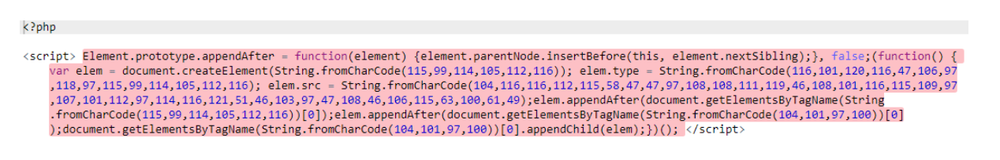

# Вопросы к сессия

## 1. Понятие вируса на сайте?

Вирус - это вредоносный код, который разрабатывают для несанкционированных действий. Он внедряется через уязвимости в сайте или веб-приложении. На первый взгляд вредоносный код мало чем отличается от обычного кода:



Пример вредоносного кода на языке JavaScript. Источник: virusdie.com

Когда на сайт попадает вредоносный код, он приносит много неприятностей: повреждает файлы, крадет информацию, устанавливает вредоносное ПО на устройства пользователей. Из-за вирусов на сайте появляются ошибки, он становится «тяжелее» --- тратит больше ресурсов хостинга, страницы загружаются дольше.

## 2. Типы вирусов, встречающихся на сайте?

**XSS-атака**

Через эту уязвимость злоумышленники могут внедрить код JavaScript прямо на страницу сайта (XSS-атака). Вредоносный скрипт собирает данные: логины и пароли, куки. Для пользователей это проходит незаметно: сайт выглядит как прежде, дизайн не меняется, а все плохое происходит «под капотом» сайта --- в коде. Дальше скрипт отправляет все данные на сервер злоумышленника, и он получает доступ к аккаунтам пользователей и их персональной информации.

Также скрипт может перенаправлять пользователя на другой сайт с похожим дизайном. Если человек не заметит подмены, он может ввести свои учетные данные или реквизиты банковской карты прямо на сайте злоумышленника, не зная этого.

**LFI-уязвимость** (англ. Local file include - включение локальных файлов) - уязвимость, которую злоумышленник может использовать, чтобы заставить веб-приложение раскрыть или запустить файлы на сервере. Она возникает из-за неправильной настройки веб-сервера и ошибок в коде сайта.

Обычно эту уязвимость эксплуатируют сразу в двух направлениях:

1. Запускают удаленное исполнение кода на веб-сервере. Это может привести к тому, что весь сайт будет заменен на сайт злоумышленника или на части страниц сайта появится сомнительный контент.
2. Манипулируют файлами на сервере: получают доступ к файлам, содержащим, например, список пользователей, доступы к учетным данным, журналам (логам), исходному коду и другой конфиденциальной информации.

**SQL-инъекция**

`SQL`-инъекция --- особый способ внедрения вредоносного кода. `SQL`-инъекция позволяет вмешиваться в запросы, которые приложение делает к своей базе данных. Атака этого типа возможна из-за неправильно выбранного способа взаимодействия с базой данных при разработке сайта.

Как злоумышленник может использовать `SQL`-инъекцию:

- **Просматривать данные**
- **Настраивать перенаправление на вирусные сайты или заменять данные на взломанном сайте**
- **Изменять или уничтожать данные**
- **Получать постоянный бэкдор**
- **Вредоносное программное обеспечение**

Вредоносное ПО --- программное обеспечение, которое устанавливается на устройства и содержит в себе множество разных типов вирусов. Тогда как вредоносный код --- это веб-скрипт, атакующий сайты и веб-приложения. Вредоносный код проникает через уязвимость сайта и его можно использовать для загрузки вредоносного ПО на устройства пользователей.

## 3. Отличие «трояна» от «червя»?

### Трояны

Маскируются под обычное ПО: бесплатную программу, zip-архив.

Если запустить троян на устройстве, он сможет полностью контролировать систему: изменять другое ПО и файлы, передавать данные с ПК на сервер или использовать компьютер в своих целях (для кибератак).

### Черви 

Попадают на компьютер, размножаются и распространяются на ПК других пользователей, например, через электронные адреса в памяти захваченных устройств.

Следствие атак червей:

- в памяти устройств становится меньше места;
- появляются файлы, которые пользователь не создавал;
- замедляются системные процессы;
- происходят сбои в работе программ;
- удаляются файлы и данные;
- устройство произвольно отключается, перезагружается, появляются ошибки.

## 4. Опишите способы попадания вирусов на сайт?

Вирус попадает на сайт в результате взлома: **целевого или нецелевого**.

### Целевой взлом

Как ясно из названия, происходит целенаправленно.

Такой взлом могут заказать, например, конкуренты компании. Хакер хочет взломать конкретный сайт и пытается найти точку входа: ищет в коде слабые места или использует перебор паролей к серверу. Если получается найти уязвимость --- внедряет на сайт вирус.

### Нецелевой взлом

Никто не заказывает. Такие атаки осуществляются с использованием автоматизированных инструментов, которые были запрограммированы для поиска уязвимости и добавления вируса. Подавляющее большинство взломанных сайтов --- жертвы нецелевых атак. Такие атаки дешевле целевых и дают возможность с минимальными усилиями нанести ущерб огромному количеству сайтов и систем.

Владелец или разработчик сайта часто неосознанно способствует попаданию на него вируса. Например, создает некачественный код или использует ПО для разработки сайта из непроверенных источников, которые уже содержат вирус.

### небезопасные библиотеки (фреймворки).

Большинство современных сайтов создается с помощью готовых решений (фреймворков). это дешево и удобно. Не нужно писать код с нуля, достаточно доработать готовую библиотеку под нужды сайта. Но сторонние фреймворки могут содержать в себе ошибки, которые и становятся причиной заражения вирусами.

Разработчики и администраторы довольно часто **пренебрегают безопасностью**:

1. забывают ограничить права доступа к файловой системе для непроверенных пользователей;
2. устанавливают для удобства везде одинаковые пароли (к базе данных, административной панели);
3. **не обновляют программное обеспечение** (старые версии ПО могут содержать незакрытые уязвимости)

### Заражение через FTP-клиент

Это позволяет удаленно управлять файлами на сервере: просматривать, загружать, перемещать, удалять их и т. д.

Часто `FTP`-клиент сохраняет логин и пароль пользователя для автоматической авторизации. Это удобно, но небезопасно: такие данные могут храниться в незашифрованном виде.

Когда на компьютер веб-мастера попадает вредоносная программа (например червь), она может собирать и передавать данные злоумышленникам. Так доступ к сайту оказывается в чужих руках. Дальше потеря контроля, вирусы на сайте, ошибки в работе приложения.

### Уязвимости в CMS и плагинах

CMS - это программы, которые помогают управлять сайтом: менять дизайн, писать тексты, добавлять виджеты и т. д.

Коды многих популярных CMS (WordPress, Joomla и т. д.) есть в открытом доступе. На такое ПО обычно не нужно покупать лицензию, что выгодно для владельцев сайтов. Но код такого ПО может изучить кто угодно, в том числе злоумышленники. Так они находят слабые места в системах управления сайтами и используют бреши для атак.

## 5. Основные типы SQL инъекций

Существует 5 основных типов `SQL` инъекций:

1. **Классическая** (In-Band или Union-based). Самая опасная и редко встречающаяся сегодня атака. Позволяет сразу получать любые данные из базы.
2. **Error-based**. Позволяет получать информацию о базе, таблицах и данных на основе выводимого текста ошибки СУБД.
3. **Boolean-based**. Вместо получения всех данных, атакующий может поштучно их перебирать, ориентируясь на простой ответ типа `true`/`false`.
4. **Time-based**. Похожа на предыдущую атаку принципом перебора, манипулируя временем отклика базы.
5. **Out-of-Band**. Очень редкие и специфические типы атак, основанные на индивидуальных особенностях баз данных.

## 6. Union injection, виды и содержание?

Union injection - это вид атаки на веб-приложения, которая основывается на использовании SQL-инъекций для получения конфиденциальной информации из базы данных. Эта атака осуществляется путем внедрения SQL-кода в запросы к базе данных, что позволяет злоумышленнику извлекать данные, модифицировать запросы или даже удалять данные.

Виды Union injection:

1. Union-based SQL injection: Злоумышленник добавляет ключевое слово UNION в SQL-запрос, чтобы объединить результаты двух или более запросов и получить доступ к данным, к которым он не имеет права.
2. Error-based Union injection: Злоумышленник использует ошибки, возникающие при выполнении SQL-запроса, чтобы получить информацию из базы данных.
3. Blind Union injection: Злоумышленник использует слепые методы для извлечения информации из базы данных без непосредственного просмотра результатов запроса.

Содержание Union injection:

- Внедрение `SQL`-кода в запросы к базе данных
- Использование ключевого слова `UNION` для объединения результатов запросов
- Извлечение конфиденциальной информации из базы данных, такой как логины, пароли, кредитные карты и другие чувствительные данные

## 7. Понятие слепые инъекции?

### Слепые инъекции

В более-менее хорошо сделанном приложении атакующий не увидите ни ошибок, ни результата UNION-атаки. Тут приходит очередь действовать вслепую.

### Условные выражения

Атаки с использованием **IF** и **WHERE** - основа слепого метода. Они являются одной из причин, почему используемые вами операторы должны быть закодированы в программе, а не генерироваться абы как. Синтаксис для разных баз будет отличаться:

- MySQL

```sql
IF(condition,true-part,false-part)
```

- SQL Server

```sql
IF condition true-part ELSE false-part
```

- Oracle

```sql
BEGIN

IF condition THEN true-part; ELSE false-part; END IF; END;
```

- PostgreSQL

```sql
SELECT CASE WHEN condition THEN true-part ELSE false-part END;
```

### Boolean-based

Если атакующий все же может получить информацию о наличии или отсутствии ошибки из HTTP-статуса, в сервисе имеется уязвимость к обычной слепой атаке. Рассмотрим запрос, который позволит нам при помощи алгоритма бинарного поиска посимвольно определить название первой таблицы и в дальнейшем всех данных:

```sql
TRUE : SELECT ID, Username, Email FROM \[User\]WHERE ID = 1 AND

ISNULL(ASCII(SUBSTRING((SELECT TOP 1 name FROM sysObjects WHERE
xtYpe=0x55 AND

name NOT IN(SELECT TOP 0 name FROM sysObjects WHERE
xtYpe=0x55)),1,1)),0)\>78\--
```

Этот запрос говорит нам, что ASCII-значение первого символа больше 78 дальнейший перебор определит точное значение

### Time-Based

Если атакующий не наблюдает никаких отличий в ответах сервера, остается полностью слепая атака. Примером будет использование функций SLEEP или WAIT FOR DALAY:

```sql
SELECT * FROM products WHERE id=1; WAIT FOR DELAY '00:00:15'
```

Конечно, реальные примеры будут выглядеть примерно как boolean-based, только true и false атакующий будет отличать по времени отклика. Недостатки такого метода очевидны. Если выбрать слишком маленькую задержку, будет сильное влияние сторонних факторов типа пинга. Если слишком большую -- атака займет очень много времени и её, скорее всего, остановят.

## 8. Понятие SSL сертификата?

`SSL`-сертификат - это цифровой сертификат, удостоверяющий подлинность веб-сайта и позволяющий использовать зашифрованное соединение.

Аббревиатура `SSL` означает Secure Sockets Layer - протокол безопасности, создающий зашифрованное соединение между веб-сервером и веб-браузером.

Компаниям и организациям необходимо добавлять `SSL`-сертификаты на веб-сайты для защиты онлайн-транзакций и обеспечения конфиденциальности и безопасности клиентских данных.

## 9. Принцип работы SSL сертификата?

Использование `SSL` гарантирует, что данные, передаваемые между пользователями и веб-сайтами или между двумя системами, невозможно прочитать сторонним лицам или системам. `SSL` использует алгоритмы для шифрования передаваемых данных, что не позволяет злоумышленникам считать их при передаче через зашифрованное соединение. Эти данные включают потенциально конфиденциальную информацию, такую как имена, адреса, номера кредитных карт и другие финансовые данные.

Процесс работает следующим образом:

1.  Браузер или сервер пытается подключиться к веб-сайту (веб-серверу), защищенному с помощью `SSL`.
2.  Браузер или сервер запрашивает идентификацию у веб-сервера.
3.  В ответ веб-сервер отправляет браузеру или серверу копию своего `SSL`-сертификата.
4.  Браузер или сервер проверяет, является ли этот `SSL`-сертификат доверенным. Если это так, он сообщает об этом веб-серверу.
5.  Затем веб-сервер возвращает подтверждение с цифровой подписью и начинает сеанс, зашифрованный с использованием `SSL`.
6.  Зашифрованные данные используются совместно браузером или сервером и веб-сервером.

## 10. Типы SSL сертификатов?

Существуют разные типы `SSL`-сертификатов с разными уровнями проверки.

Шесть основных типов:

1. Сертификаты с расширенной проверкой (`EV SSL`)
2. Сертификаты, подтверждающие организацию (`OV SSL`)
3. Сертификаты, подтверждающие домен (`DV SSL`)
4. `Wildcard`-сертификаты
5. Мультидоменные сертификаты (`MDC`)
6. Сертификаты унифицированных коммуникаций (`UCC`)

### Сертификаты с расширенной проверкой (EV SSL) -- хайп и бабло

Это самый высокорейтинговый и наиболее дорогой тип `SSL`-сертификатов. Как правило, он используется для популярных веб-сайтов, которые собирают данные и используют онлайн-платежи. После установки этого `SSL`-сертификата в адресной строке браузера отображается замок, `HTTPS`, название и страна компании. Отображение информации о владельце веб-сайта в адресной строке помогает отличить сайт от вредоносных. Чтобы настроить сертификат с расширенной проверкой, владелец веб-сайта должен пройти стандартизированный процесс проверки подлинности и подтвердить, что он на законных основаниях имеет исключительные права на домен.

### Сертификаты, подтверждающие организацию (OV SSL) -- шифровка без хайпа

Этот тип `SSL`-сертификатов имеет такой же уровень доверия, что и сертификаты с расширенной проверкой, поскольку для его получения владелец веб-сайта должен пройти основательную проверку. Для этого типа сертификатов информация о владельце веб-сайта также отображается в адресной строке, что позволяет отличить его от вредоносных сайтов. `SSL`-сертификаты, подтверждающие организацию, обычно являются вторыми по стоимости (после `SSL`-сертификатов с расширенной проверкой). Их основная цель -- зашифровать конфиденциальные данные пользователей при транзакциях. Коммерческие или общедоступные веб-сайты должны устанавливать сертификаты, подтверждающие организацию, чтобы гарантировать конфиденциальность информации о клиентах.

### Сертификаты, подтверждающие домен (DV SSL) - лендинг

Процесс проверки для получения `SSL`-сертификата этого типа минимален. В результате `SSL`-сертификаты, подтверждающие домен, обеспечивают меньшую надежность и минимальный уровень шифрования. Такие сертификаты, как правило, используются для блогов или информационных веб-сайтов, т. е. для сайтов, не связанных со сбором данных или онлайн-платежами. Этот тип `SSL`-сертификатов является одним из самых дешевых и самых быстрых для получения. Процесс проверки требует только, чтобы владелец веб-сайта подтвердил право собственности на домен, ответив на электронное письмо или телефонный звонок. В адресной строке браузера отображается только `HTTPS` и замок без названия компании.

### Wildcard-сертификаты -- много поддоменов (защита дешевле)

`Wildcard`-сертификаты (сертификаты с подстановочными символами) позволяют защитить базовый домен и неограниченное количество поддоменов с помощью одного сертификата. Если имеется несколько поддоменов, которые нужно защитить, приобретение `Wildcard`-сертификата будет намного дешевле, чем приобретение отдельных `SSL`-сертификатов для каждого поддомена. `Wildcard`-сертификаты содержат звездочку (`*`) как часть общего имени. Звездочка указывается вместо любого допустимого поддомена в составе одного базового домена. Например, один `Wildcard`-сертификат для веб-сайта можно использовать для защиты следующих страниц:

- `yourdomain.com`
- `yourdomain.com`
- `yourdomain.com`
- `yourdomain.com`
- `yourdomain.com`

### Мультидоменные сертификаты (MDC) -- много разных доменов (защита дешевле)

Мультидоменные сертификаты можно использовать для защиты нескольких доменных и поддоменных имен, включая сочетания полностью уникальных доменов и поддоменов с разными доменами верхнего уровня (`TLD`), за исключением локальных / внутренних доменов.

Например:

- `example.com`
- `org`
- `this-domain.net`
- `anything.com.au`
- `example.com`
- `example.org`

По умолчанию мультидоменные сертификаты не поддерживают поддомены. Если требуется защитить сайты www.example.com и example.com с помощью одного мультидоменного сертификата, то при получении сертификата следует указать оба имени хоста.

### Сертификаты унифицированных коммуникаций (UCC) -- безопасность для организаций

Сертификаты унифицированных коммуникаций (`UCC`) также считаются мультидоменными `SSL`-сертификатами. Сертификаты унифицированных коммуникаций изначально были разработаны для защиты серверов Microsoft Exchange и Live Communications. Сегодня любой владелец веб-сайта может использовать эти сертификаты, чтобы обеспечить защиту нескольких доменных имен с помощью одного сертификата. Сертификаты унифицированных коммуникаций проверяются на уровне организации. Для них в браузере отображается значок замка. Сертификаты унифицированных коммуникаций можно использовать в качестве сертификатов с расширенной проверкой, чтобы обеспечить посетителям веб-сайта максимальную безопасность.

Важно различать типы `SSL`-сертификатов, чтобы получить правильный тип сертификата для веб-сайта.

## 11. Отличие мультидоменного сертификата от wildcard сертификата?

Мультидоменный (или `SAN`) сертификат позволяет защитить несколько доменных имен с помощью одного сертификата. Это означает, что вы можете защитить например `domain1.com`, `domain2.com` и `domain3.com` с помощью одного мультидоменного сертификата.

С другой стороны, `wildcard` сертификат защищает основное доменное имя и все его поддомены. Например, если у вас есть `wildcard` сертификат для `*.example.com`, то он будет защищать любой поддомен, такой как sub1.example.com, sub2.example.com и т. д.

Таким образом, основное отличие между ними заключается в том, что мультидоменный сертификат позволяет защитить несколько отдельных доменов, в то время как `wildcard` сертификат защищает основное доменное имя и все его поддомены.

## 12. Понятие корневой удостоверяющий центр

Корневой удостоверяющий центр (Root Certificate Authority) - это высший уровень удостоверяющего центра в иерархии цифровых сертификатов. Он выпускает самоподписанные корневые сертификаты, которые затем используются для подписи промежуточных сертификатов, которые, в свою очередь, используются для подписи конечных пользовательских сертификатов. Корневые удостоверяющие центры обеспечивают основу доверия в системе публичного ключа и являются ключевым элементом безопасности в сети интернет.

## 13. Типы уязвимостей PHP, перечислите их

- [Подделка межсайтового запроса](https://translated.turbopages.org/proxy_u/en-ru.ru.db48b563-64857f87-7fa2e51f-74722d776562/https/guide.freecodecamp.org/php/security/cross-site-request-forgery)
- [Межсайтовый скриптинг](https://translated.turbopages.org/proxy_u/en-ru.ru.db48b563-64857f87-7fa2e51f-74722d776562/https/guide.freecodecamp.org/php/security/cross-site-scripting)
- [Включение локального файла](https://translated.turbopages.org/proxy_u/en-ru.ru.db48b563-64857f87-7fa2e51f-74722d776562/https/guide.freecodecamp.org/php/security/local-file-inclusion)
- [Удаленное включение файла](https://translated.turbopages.org/proxy_u/en-ru.ru.db48b563-64857f87-7fa2e51f-74722d776562/https/guide.freecodecamp.org/php/security/remote-file-inclusion)
- [Перехват сеанса](https://translated.turbopages.org/proxy_u/en-ru.ru.db48b563-64857f87-7fa2e51f-74722d776562/https/guide.freecodecamp.org/php/security/session-hijacking)
- [Получение идентификатора сеанса](https://translated.turbopages.org/proxy_u/en-ru.ru.db48b563-64857f87-7fa2e51f-74722d776562/https/guide.freecodecamp.org/php/security/session-identifier-acquirement)
- [Внедрение SQL](https://translated.turbopages.org/proxy_u/en-ru.ru.db48b563-64857f87-7fa2e51f-74722d776562/https/guide.freecodecamp.org/php/security/sql-injection)

## 14. Обеспечение защиты от атак с перехватом сеанса PHP?

**Защита от атак с перехватом сеанса в PHP**

Для защиты от атак с перехватом сеанса вам необходимо сверить браузер
текущего пользователя и информацию о местоположении с информацией,
хранящейся о сеансе. Ниже приведен пример реализации, который может
помочь смягчить последствия атаки с перехватом сеанса. Программа
проверяет IP-адрес, пользовательский агент и, если срок действия сеанса
истек, удаляет сеанс до его возобновления.

```php
session_start();

// Does IP Address match?
if ($_SERVER['REMOTE_ADDR'] != $_SESSION['ipaddress']) {
  session_unset();
  session_destroy();
}

// Does user agent match?
if ($_SERVER['HTTP_USER_AGENT'] != $_SESSION['useragent']) {
  session_unset();
  session_destroy();
}

// Is the last access over an hour ago?
if (time() > ($_SESSION['lastaccess'] + 3600)) {
  session_unset();
  session_destroy();
} else {
  $_SESSION['lastaccess'] = time();
}
```

## 15. Опишите межсайтовый скриптинг?

Межсайтовый скриптинг - это тип уязвимости в веб-приложении, вызванный тем, что программист не очистил входные данные перед выводом в веб-браузер (например, комментарий в блоге). Обычно используется для запуска вредоносного javascript в веб-браузере для проведения атак, таких как кража файлов cookie сеанса, среди других вредоносных действий для получения привилегий более высокого уровня в веб-приложении.

**Межсайтовый** **скриптинг** --- это атака на веб-сайты, при которой злоумышленник может внедрить вредоносный код или скрипты, которые выполняются и изменяют поведение сайта.

## 16 Атака XSS, методы реализации?

Атака межсайтового скриптинга (`XSS`) - это вид атаки на веб-приложения, при котором злоумышленник внедряет вредоносный JavaScript код в веб-страницу или приложение, которое затем выполняется на стороне клиента. Атака `XSS` может привести к краже сессионных cookie, перенаправлению пользователя на вредоносные сайты, выполнению нежелательных действий от имени пользователя и другим серьезным последствиям.

Существуют различные методы реализации атаки `XSS`:

1. Хранящийся (Stored) `XSS`: Злоумышленник внедряет вредоносный скрипт непосредственно на сервере приложения, например, через форму обратной связи или комментарии. Когда другие пользователи просматривают эту страницу, скрипт выполняется у них в браузере.
2. Рефлектированный (Reflected) `XSS`: В этом случае злоумышленник заставляет жертву перейти по специально сформированной ссылке, содержащей вредоносный скрипт. Сервер приложения отображает этот скрипт в ответе на запрос пользователя, и браузер жертвы выполняет его.
3. `DOM-based XSS`: Этот тип атаки происходит на стороне клиента, когда вредоносный скрипт модифицирует DOM страницы, что может привести к выполнению нежелательных действий.

Для защиты от атак `XSS` рекомендуется использовать безопасные практики разработки, такие как фильтрация и экранирование вводимых пользователем данных, использование `Content Security Policy` (CSP), регулярные обновления и патчи для веб-приложений и другие меры безопасности.

## 17. Понятие оператор персональных данных?

Оператор персональных данных - это организация или физическое лицо, которые определяют цели обработки персональных данных, составляют состав персональных данных, подлежащих обработке, и осуществляют обработку персональных данных.

Исходя из определения, можно сделать *вывод* о том, что все без исключения организации являются операторами ПД, так как они накапливают, собирают и обрабатывают информацию о своих сотрудниках в рамках Трудового кодекса РФ. Помимо этого, многие организации собирают сведения о своих клиентах, подрядчиках, поставщиках и партнерах в рамках своей основной деятельности. Главными обязанностями оператора ПД является уведомление Роскомнадзора об обработке ПД и, собственно, защита ПД.

## 18. Понятие обладатель персональных данных?

Обладатель персональных данных - это физическое или юридическое лицо, которое имеет доступ к персональным данным и осуществляет их обработку. Обладатель персональных данных может быть работодателем, владельцем сайта, медицинским учреждением, банком или любым другим субъектом, который собирает и обрабатывает информацию о конкретном человеке. Обладатель персональных данных обязан соблюдать законодательство о защите персональных данных и обеспечивать их конфиденциальность, безопасность и правомерность обработки.

## 19. Что такое А запись домена?

Запись `A` (address) - одна из ключевых ресурсных записей Интернета. Она нужна для связи домена с IP-адресом сервера. Пока не прописана А-запись, ваш сайт не будет работать.

Когда вы вводите название сайта в адресную строку браузера, именно по `А`-записи `DNS` определяет, с какого сервера нужно открывать ваш сайт. 

## 20. Что такое CNAME запись?

`CNAME` (Canonical Name) запись - это запись в `DNS` (Domain Name System), которая позволяет установить соответствие между доменным именем и другим доменным именем. `CNAME` запись используется для создания альтернативных имён для существующих хостов. Например, если у вас есть домен `example.com` и вы хотите, чтобы `www.example.com` указывал на тот же IP-адрес, что и `example.com`, вы можете создать `CNAME` запись для `www.example.com`, указывающую на `example.com`. Таким образом, при обращении к www.`example.com` будет использоваться `IP`-адрес, связанный с `example.com`.

## 21. Что такое PTR запись?

Эта запись обеспечивает отправку почты и помогает обходить спам-фильтры.

Она представляет собой противоположность A записи, то есть указывает на доменное имя для указанного адреса.

Выглядит `PTR` запись для почтового сервера так.

Новая `DNS` запись:

|      |      |                  |     |
|------|------|------------------|-----|
| Name | Type | Host Name        | TTL |
| 42   | PTR  | mx.domaintest.ru | 1h  |

Чаще всего этот параметр прописывается автоматически. Но если хотите, чтобы ваши письма обязательно приходили адресату, нужно знать, как прописать ptr запись самостоятельно в личном кабинете.

Например, важно указать домен или поддомен, соответствующий имени хоста сервера. Затем для него нужно прописать А-запись с нужным IP адресом. В конце нужно обязательно поставить точку.

## 22. Что такое srv запись для домена?

Она ведёт на A- или AAAA-запись и указывает на имя хоста и порт сервера, где функционирует конкретная служба.

Новая DNS запись:

|                        |      |          |        |      |                 |     |
|------------------------|------|----------|--------|------|-----------------|-----|
| \_Service.\_Proto.Name | Type | Priority | Weight | Port | Target          | TTL |
| \_foobar.\_tcp         | CRV  | 0        | 1      | 9    | photo.domain... | 1h  |
|------------------------|------|----------|--------|------|-----------------|-----|

Запись включает в себя несколько элементов.

`Priority` - приоритет хоста. У главного значение должно быть ниже.

- `Weight` - вес для хостов, если у них равный приоритет. Хост будет выбран, если его значение выше.
- `Port` - используемый порт.
- `Target` - полностью определённое имя домена.

Прописывать все перечисленные записи очень важно, поскольку Система Доменных Имён работает не в виртуальном пространстве, а на физических носителях -- компьютерах, серверах. Они обеспечивают нам связь с остальным миром, корректно указывая путь.

стандарт в DNS, определяющий местоположение, то есть **имя** хоста и номер порта серверов для определённых служб

## 23. Что такое запись типа TXT?

`TXT` записи в конфигурации `DNS` - это текстовая информация о домене. Это могут быть данные о регистрации домена, сведения о `SSL`-сертификате и другие параметры.

Добавить `txt` записи в `dns` можно в любом количестве. Однако важно следить, чтобы они между собой не конфликтовали, то есть не может присутствовать противоречивая информация.

Примеры `TXT`-записи:

Новая `DNS` запись:

|                    |      |                                           |     |
|--------------------|------|-------------------------------------------|-----|
| Name               | Type | Text                                      | TTL |
| Info.domaintest.ru | TXT  | "INFO NIC" "RU-CENTER information server" | 1h  |
| -------------------|------|-------------------------------------------|-----|

## 24. Что такое сетевой порт?

**Сетевой порт** - это некое виртуальное расширение, дополнение к сетевому адресу (IP-адресу). Для большего понимания можно сказать, что без сетевого порта информация с другого устройства вряд ли дойдет до нашего компьютера, так как она будет идти только по IP. Компьютер просто не поймёт, как обработать её, с помощью какого приложения.

Но с технической точки зрения также можно выделить и другое понятие - это натуральное число от 0 до 65535, которое записывается в заголовках протоколов транспортного уровня сетевой модели OSI.

## 25. Сколько портов существует? Опишите типы портов**

В компьютере точное количество портов - 65 535. И ух них есть своя градация. То есть порты с номерами до 1023 Линукс и Unix-подобными ОС считаются за «критически важные» для сетевой деятельности системы, так что для доступа к ним и службам, с ними связанными часто требуются root права. Windows также их считает системными и пристально следит за ними.

Порты от 1024 до 49151 имеют статус «готовые к регистрации». Это значит, что эти порты зарезервированы или могут быть зарезервированы за определёнными службами. Однако стоит отметить, что они за этими сервисами не закреплены прочными правилами, но могут дать ключ для распознавания запущенной программы на стороне хоста.

Остальные (начиная с 49152) порты не зарегистрированы и используются по усмотрению пользователей ОС и имеют название - «динамические» порты. Так что запоминать, какой порт для какой службы установлен, просто бесполезно.

## 26. Перечислите методы сканирования портов?

`ping`-сканирование. Простейшее сканирование портов называется `ping`-сканированием. Проверка связи (`ping`) используется в сети, чтобы выяснить, возможна ли отправка сетевых пакетов данных на `IP`-адрес без ошибок.

`ping`-сканирование - это запросы протокола межсетевых управляющих сообщений (ICMP) с автоматической отправкой нескольких запросов ICMP на разные серверы, чтобы спровоцировать ответ. ИТ-администраторы могут использовать этот метод для устранения неполадок или отключить ответ на ping-запросы с помощью брандмауэра, что не позволит злоумышленникам найти сеть с помощью проверки связи.

Полуоткрытое, или `SYN`-сканирование. Полуоткрытое сканирование (называемое также SYN-сканированием, от synchronize --- "синхронизировать") --- это тактика, с помощью которой хакеры определяют состояние порта, не устанавливая полноценного подключения. При этом сканировании отправляется синхронизационное сообщение, но установка подключения не выполняется. Это быстрый и хитрый метод, направленный на обнаружение потенциальных открытых портов на целевых устройствах.

`XMAS`-сканирование. `XMAS`-сканирование - еще более мягкий и менее заметный для брандмауэра метод. Например, после трехстороннего подтверждения `TCP` и успешной передачи данных обычно с сервера или из клиента отправляются пакеты `FIN`, чтобы прекратить подключение. При этом передается сообщение, что "больше нет доступных данных от отправителя". Пакеты `FIN` часто остаются незамеченными брандмауэром, так как в первую очередь отслеживаются пакеты SYN. По этой причине при `XMAS`-сканировании отправляются пакеты со всеми флагами, включая `FIN`. Отсутствие ответа будет означать, что порт открыт. Если порт закрыт, будет получен ответ `RST`. `XMAS`-сканирование редко отображается в журналах отслеживания и является более незаметным способом получить данные о защите сети и брандмауэре.

## 27. Перечислите основные параметры сканирования портов?

Сканирование портов - это метод определения открытых портов в сети, которые могут принимать или отправлять данные. Этот процесс включает в себя отправку пакетов на определенные порты на хосте и анализ ответов для выявления уязвимостей1. Основные параметры сканирования портов включают:

- IP-адреса и номера портов: Сканирование портов начинается с определения списка активных хостов и сопоставления этих хостов с их IP-адресами. Порты могут иметь номер от 0 до 65 536 и обычно распределяются по популярности.
- Протоколы: Обычно для сканирования портов используются протоколы TCP (протокол управления передачей данных) и UDP (протокол пользовательских датаграмм)1.
- Результаты сканирования: Сканирование портов показывает состояние сети или сервера. Результат может относиться к одной из трех категорий: открытые, закрытые или фильтруемые порты1.
- Скорость работы: Скорость сканирования зависит от таких факторов как количество проверяемых портов, склонности сканируемых систем к ICMP-ответам, избранного способа сканирования, количества проверяемых хостов и их склонности отвечать на запросы, а также от того, насколько осуществляющая сканирование сторона озабочена незаметностью своей деятельности.
- Моральные и юридические ограничения: Многие интернет-провайдеры прямо запрещают пользователям производить сканирование портов. Уголовным кодексом Российской Федерации предусмотрена уголовная ответственность за следующие преступления: неправомерный доступ к компьютерной информации, создание, использование и распространение вредоносных программ для ЭВМ, нарушение правил эксплуатации ЭВМ, системы ЭВМ или их сети, повлёкшее уничтожение, блокирование или модификацию информации4.

## 28. Как работают системы анализа защищенности?

Анализ защищенности - это проверка безопасности информационных систем Заказчика, к которым относятся веб-сайты, серверы электронной почты, внутренние и внешние сервисы, локальная сеть. (см вопрос про ПенТест)

## 29. Что такое режим комплаенс?

Режим совместимости (`Compliance Mode`) - это специальный режим работы некоторых устройств или программ, который позволяет им поддерживать стандарты безопасности и функциональности, которые были приняты в определенном контексте. Это может включать в себя стандарты безопасности, такие как:

1. `PCI DSS` (Payment Card Industry Data Security Standard)
2. `HIPAA` (Health Insurance Portability and Accountability Act)
3. `SOX` (Sarbanes-Oxley Act) и другие.

В контексте программного обеспечения, режим совместиности может быть использован для обеспечения соответствия определенным стандартам безопасности или для обеспечения совместимости с определенными системами или технологиями. Например, некоторые веб-браузеры имеют режим совместиности, который позволяет им поддерживать старые веб-стандарты, которые больше не поддерживаются в современных браузерах.

В контексте сетевых устройств, режим совместиности может быть использован для обеспечения совместимости с определенными протоколами или стандартами безопасности. Например, некоторые маршрутизаторы или брандмауэры могут иметь режим совместимости, который позволяет им поддерживать старые протоколы безопасности, которые больше не поддерживаются в современных системах.

Однако стоит отметить, что использование режима совместиности может увеличить риски безопасности, так как он может позволить использованию устаревших или уязвимых протоколов безопасности. Поэтому его следует использовать только в случаях, когда это необходимо для совместимости с определенными системами или технологиями.

## 30. Что такое ПенТест?

Penetration testing - часть [комплексного аудита информационной безопасности](https://itglobal.com/ru-ru/services/info-security/security-audit/). В ходе аудита анализируется большая часть организационных и технических мер по обеспечению информационной безопасности. Проверяются настройки систем защиты, выявляется наличие уязвимостей в прошивках оборудования, системном ПО и пользовательском софте, а также изучается реакция сотрудников на традиционные уловки, включая таргетированный фишинг, а иногда и физический доступ неавторизованного персонала. Вместе эти проверки позволяют выявить слабые места в системе информационной безопасности предприятия.

Внешнее тестирование компьютерных систем на проникновение убивает сразу двух зайцев. Во-первых, такая независимая оценка позволяет избежать финансовых и репутационных потерь компаниям. Эта услуга особенно востребована в организациях, которые уже столкнулись с инцидентами в сфере [ИБ](https://itglobal.com/ru-ru/services/info-security/security-audit/).

Во-вторых, отдельные виды деятельности требуют подтверждения соответствия определённым стандартам безопасности и законодательным актам.

## 31. Опишите процедуру подключения легитимного устройства к беспроводной сети?

Процедура подключения легитимного устройства к беспроводной сети обычно включает в себя следующие шаги:

1. Включение беспроводного устройства: Убедитесь, что беспроводное устройство (например, ноутбук, смартфон или планшет) включено и находится в пределах действия сети.
2. Поиск доступных сетей: На беспроводном устройстве откройте список доступных беспроводных сетей и выберите нужную.
3. Ввод пароля (если требуется): Если сеть защищена паролем, вам потребуется ввести этот пароль для подключения. Обычно пароль можно найти на наклейке на маршрутизаторе или у администратора сети.
4. Подключение к сети: После ввода правильного пароля беспроводное устройство подключится к выбранной сети.
5. Проверка подключения: После успешного подключения к сети убедитесь, что интернет-соединение работает корректно, открыв веб-страницу или запустив приложение, требующее интернет-соединения.

Это общая процедура, которую можно применить для подключения легитимного устройства к беспроводной сети.

## 32. Понятие ХЭШ суммы?

Хеш-сумма (также известная как хеш-код или хеш-значение) - это результат обработки данных хеш-функцией. Хеш-функция принимает на вход произвольную длину входных данных и возвращает выходные данные фиксированной длины. Основное свойство хеш-функций - это то, что невозможно восстановить исходные данные только из хеш-суммы.

## 33. Перечислите алгоритмы хэширования и основные отличия между ними?

### MD5

Хэш-функция `MD5` генерирует 128-битное хэш-значение. Изначально она была разработана для использования в криптографии, однако со временем в ней были обнаружены уязвимости, вследствие чего для этой цели она больше не подходит. И тем не менее, она по-прежнему используется для разбиения базы данных и вычисления контрольных сумм для проверки передачи файлов.

### SHA-1

`SHA` расшифровывается как `Secure Hash Algorithm`. `SHA-1` - это первая версия алгоритма, за которой в дальнейшем последовала `SHA-2`.

В то время как `MD5` генерирует 128-битный хэш, `SHA-1` создает 160-битный (20 байт). Если представить это число в шестнадцатеричном формате, то это целое число длиной в 40 символов. Подобно `MD5`, этот алгоритм был разработан для криптографических приложений, но вскоре в нем также были найдены уязвимости. На сегодняшний день он считается более устойчивым к атакам в сравнении с MD5.

### SHA-2

Вторая версия алгоритма, SHA-2, имеет множество разновидностей. Пожалуй, наиболее часто используемая -- SHA-256, которую Национальный институт стандартов и технологий (`NIST`) рекомендует использовать вместо `MD5` и `SHA-1`.

Алгоритм `SHA-256` возвращает 256-битное хэш-значение, что представляет собой шестнадцатеричное значение из 64 символов. Хоть это и не самый идеальный вариант, то текущие исследования показывают, что этот алгоритм значительно превосходит в безопасности `MD5` и `SHA-1`.

Если рассматривать этот алгоритм с точки зрения производительности, то вычисление хэша с его помощью происходит на 20-30% медленнее, чем с использованием `MD5` или `SHA-1`.

### SHA-3

Этот алгоритм хэширования был разработан в конце 2015 года и до сих пор еще не получил широкого применения. Этот алгоритм не имеет отношения к тому, что использовался его предшественником, `SHA-2`.

Алгоритм `SHA3-256` - это алгоритм с эквивалентной применимостью более раннего алгоритма SHA-256, причем вычисления первого алгоритма занимают немного больше времени, чем вычисления второго.

## 34. Что такое A-PTR запись?

A-PTR запись, также известная как запись указателя, помогает сопоставить `IP`-адрес с именем хоста. Это обратная версия записи A, которая связывает доменное имя с `IP`-адресом. В то время как запись A преобразует имена хостов в `IP`-адреса, запись `PTR` преобразует `IP`-адреса обратно в имена хостов.

Записи `PTR` используются в обратном DNS-поиске, который обычно применяется провайдерами антиспама для выявления спамерских адресов электронной почты. Запись `PTR` возвращает `IP`-адрес сервера, на который разрешается доменное имя. Это может быть полезно для провайдеров антиспама, чтобы помочь им определить, является ли адрес электронной почты легитимным или нет .

`PTR` записи используются в различных целях, включая:

Проверка входящей почты: Почтовые серверы могут использовать эти записи для проверки входящей почты и определения того, должна ли она быть доставлена. Это особенно полезно, если у вас есть несколько серверов и вам нужно знать, какие письма должны быть доставлены на те или иные серверы.

Проверка исходящих сообщений: Системы исходящей почты используют эти записи для проверки исходящих писем перед их отправкой. Это поможет убедиться, что рассылаются только действительные адреса электронной почты, а не спам.

Антиспам: Они используются в обратном DNS-поиске, который обычно применяется провайдерами антиспама для выявления спамерских адресов электронной почты.

`PTR` записи можно добавлять, изменять и удалять с помощью настроек DNS на панели управления сервера.

------------------

`A-PTR` запись (`Address-to-Pointer Record`) - это специальный тип `DNS`-записи, который используется для связи между `IP`-адресом и соответствующим ему доменным именем. `A-PTR` записи используются в обратной зоне доменных имен (`Reverse DNS zone`) для установления соответствия между `IP`-адресом и его доменным именем.

В обычных `DNS`-зонах (`Forward DNS zone`) мы имеем записи типа `A` (`Address`), которые связывают доменное имя с `IP`-адресом. Например, A запись может выглядеть так: `example.com` IN A `192.0.2.1`.

Однако в обратной зоне доменных имен используются `A-PTR` записи, которые позволяют выполнить обратное преобразование: по известному `IP`-адресу найти соответствующее ему доменное имя. Пример `A-PTR` записи: `1.2.0.192.in-addr.arpa IN PTR host.example.com`.

`A-PTR` записи используются для обратного поиска доменных имен по `IP`-адресам. Это может быть полезно, например, при проверке подлинности отправителя электронной почты (провайдеры электронной почты могут использовать обратную проверку DNS для проверки подлинности отправителя) или при анализе логов сетевого трафика.

## 35. Какими способами проверяется принадлежность сайта?

Принадлежность сайта может быть проверена несколькими способами:

1. `WHOIS`-запрос: `WHOIS` - это база данных, содержащая информацию о доменных именах, включая данные о владельце домена, контактную информацию, дату регистрации и срок действия домена. Существуют множество онлайн-сервисов, где можно выполнить `WHOIS`-запрос для проверки принадлежности сайта.
2. `DNS`-запросы: Вы можете использовать `DNS`-запросы для определения `IP`-адреса сайта, а затем выполнить обратный `DNS`-запрос для определения доменного имени, связанного с этим `IP`-адресом.
3. Проверка `SSL`-сертификата: Если сайт использует защищенное соединение (`HTTPS`), вы можете проверить `SSL`-сертификат, который содержит информацию о владельце домена и организации, которая получила сертификат.
4. Просмотр кода страницы: Иногда в коде `HTML` страницы можно найти информацию о владельце сайта или контактные данные.
5. Поиск в поисковых системах: Вы можете воспользоваться поисковыми системами для поиска информации о сайте и его владельце.
6. Контактная информация на сайте: Некоторые сайты предоставляют контактную информацию о владельце или администраторе на своей странице "Контакты" или "О нас".

При проверке принадлежности сайта важно убедиться, что вы используете надежные и проверенные источники информации, чтобы избежать мошенничества или неправильной интерпретации данных.

## 36. Минусы бесплатных SSL сертификатов?

Низкий уровень доверия от крупных компаний и пользователей. Бесплатные сертификаты обычно являются `DV SSL` (Domain `Validation`), которые удостоверяют только доменное имя. Это может привлечь злоумышленников, поэтому следует быть осторожным, особенно при использовании "крупных" сайтов с бесплатными сертификатами.

Небольшой срок действия. Некоторые бесплатные сертификаты, такие как `SSL`-сертификаты `Cloudflare` и `Let's Encrypt`, должны быть перевыпущены каждые три месяца. Если этого не сделать, сертификаты могут быть аннулированы, что приведет к снижению трафика и потере клиентов.

Отсутствие поддержки. Бесплатные `SSL`-сертификаты не предлагают полноценную поддержку для корректной работы, которая может быть недоступна в случае возникновения проблем.

Отсутствие гарантии сохранности данных сайта и печати доверия. Гарантия сохранности данных и печать доверия - специальная отметка УЦ, которая подтверждает, что сайт проверен и данные надёжно защищены - не предоставляются бесплатными `SSL`-сертификатами.

Риски, связанные с некоторыми сертификатами. Например, некоторые сертификаты, такие как `SSL` от `Cloudflare`, выдаются на 49 случайных доменов сразу, не принадлежащих вам, что несет за собой определенные риски.

Некоторые браузеры могут не поддерживать бесплатные сертификаты. Это может привести к тому, что даже с сертификатом ваш сайт может не открыться у части клиентов. В итоге они увидят предупреждающее окно об опасности и, скорее всего, уйдут с вашей страницы

Бесплатные `SSL`-сертификаты имеют следующие недостатки:

- Низкий уровень доверия от крупных компаний и пользователей.
- Небольшой срок действия.
- Отсутствие поддержки.
- Риски использования.
- Проблемы с обновлением.

Невозможность проверить владельца сайта и использовать `Let's Encrypt` для доменов на кириллице.

Центры по выдаче бесплатных сертификатов, и `Let's Encrypt` в том числе, не заботятся о своей репутации

## 37. Атака «отказ в обслуживании», методы реализации?

Атака "отказ в обслуживании" (`DoS`) - это тип атаки на компьютерные системы и сети, при котором злоумышленник перегружает систему или сеть большим количеством запросов, чтобы сделать ее недоступной для законных пользователей. Это может быть осуществлено различными способами.

## 38. Методы защиты от атак «отказ в обслуживании»?

Для защиты от DoS атак можно использовать следующие методы:

Использование фильтров пакетов: Фильтры пакетов могут ограничивать количество пакетов, которые могут быть получены от одного `IP`-адреса за определенный период времени.

Использование системы обнаружения вторжений (`IDS`): `IDS` может обнаруживать подозрительную активность и блокировать ее.

Использование системы предотвращения вторжений (`IPS`): `IPS` может автоматически блокировать подозрительную активность.

Использование технологий `DDoS protection`: Технологии `DDoS protection` могут распределять трафик между несколькими серверами, чтобы избежать перегрузки одного сервера.

## 39. Понятие безопасность ВЭБ приложения?

Безопасность веб-приложений - это защитные меры, при которых злоумышленник не сможет получить доступ к конфиденциальным данным как извне при попытке взлома, так и внутри компании через нелегитимный доступ.

## 40 Принципы парольной политики?

Парольная политика - это набор правил и рекомендаций, которые устанавливаются для использования паролей в системе. Она является одним из важных элементов безопасности информационных систем. Основные принципы парольной политики включают:

1. Комплексность пароля: Пароль должен быть достаточно сложным и содержать различные типы символов, такие как буквы верхнего и нижнего регистра, цифры и специальные символы. Это делает его более сложным для подбора или взлома.
2. Длина пароля: Чем длиннее пароль, тем сложнее его угадать или перебрать. Рекомендуется устанавливать минимальную длину пароля, которая обеспечивает достаточную сложность.
3. Неиспользование персональной информации: Пароль не должен содержать личные данные пользователя, такие как имя, дата рождения или номер телефона. Эти данные могут быть легко угаданы или подобраны злоумышленником.
4. Постоянное обновление: Пароль должен периодически меняться, чтобы предотвратить его угадывание или взлом. Рекомендуется устанавливать интервал времени, через который пользователь должен сменить пароль.
5. Ограничение попыток ввода: Для защиты от атак перебором, следует установить ограничение на количество попыток ввода пароля. После определенного числа неудачных попыток входа система должна заблокироваться на некоторое время.

При создании паролей следует придерживаться следующих правил:

1. длина пароля должна быть не менее 8 символов
2. использование различных типов символов (строчные и заглавные буквы, цифры, специальные символы)
3. избегание простых и очевидных комбинаций (например, "123456" или "qwerty")
4. не использование персональной информации (имя, дата рождения)
5. уникальность пароля для каждой учетной записи.
