# Ответы на теоретические вопросы по билетам

## ЭКЗАМЕНАЦИОННЫЙ БИЛЕТ №1**

### 1 Основные характеристики маршрутизатора?

Основные технические характеристики маршрутизатора связаны с тем, как он
решает свою главную задачу - маршрутизацию пакетов в составной сети.
Именно эти характеристики прежде всего определяют возможности и сферу
применения того или иного маршрутизатора.

Маршрутизация в сетях связи --- это процесс определения оптимального
маршрута данных.

Маршрутизация служит для приема пакета от одного устройства и передачи
его по сети другому устройству через другие сети. Если в сети нет
маршрутизаторов, то не поддерживается маршрутизация. Маршрутизаторы
направляют (перенаправляют) трафик во все сети, составляющие
объединенную сеть.

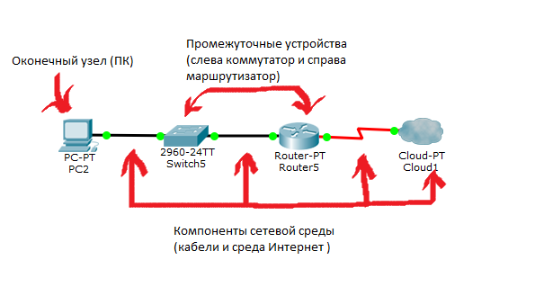{width="6.2in" height="3.28in"}

Основные характеристики маршрутизатора:

- тип: одно- или многопротокольный, LAN или WAN, Brouter
- поддерживаемые протоколы
- пропускная способность
- типы подключаемых сетей
- поддерживаемые интерфейсы (LAN и WAN)
- количество портов
- возможность управления и мониторинга сети

### 2 Отличие «белого» ip адреса от «серого»?

Итак, у нас есть два факта:

- Белые IP-адреса общаются только в глобальной сети интернет, но в то
    же время невозможно выдать каждому человеку уникальный белый
    IP-адрес.
- Серые IP-адреса между собой общаются только в пределах одной
    локальной сети. Адреса в разных локальных сетях могут повторяться, и
    это не приведет к ошибкам.

{width="6.496527777777778in"
height="1.4125in"}

бывают **белые** и **серые** (или **публичные** и **частные**). **Публичным
IP адресом** называется IP адрес, который используется для **выхода в
Интернет**. Адреса, используемые в **локальных сетях**, относят
к **частным**.

Частные IP не маршрутизируются в Интернете.

### 3 Создайте прямой патчкорд?

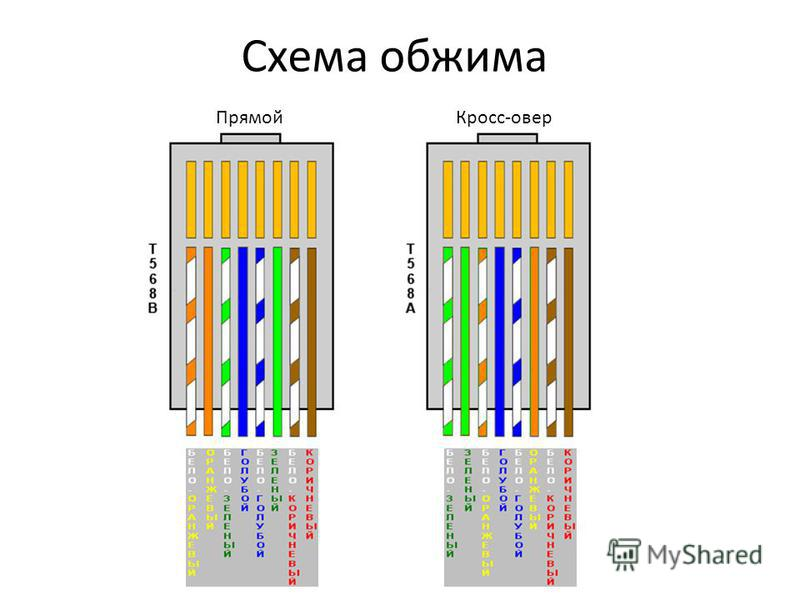{width="6.496527777777778in" height="4.21875in"}

## ЭКЗАМЕНАЦИОННЫЙ БИЛЕТ №2

### 1 Отличие маршрутизатора от коммутатора?

Маршрутизатор раздает интернет - то есть настроив его ты сможешь
подключатся к интернету с нескольких компов. Если использовать
коммутатор, то к интернету будет подключен всего один комп, на остальных
будет работать локальная сеть.

Один тупой, другой умный

[**https://www.youtube.com/watch?v=Bwg-om5NnmQ**](https://www.youtube.com/watch?v=Bwg-om5NnmQ)

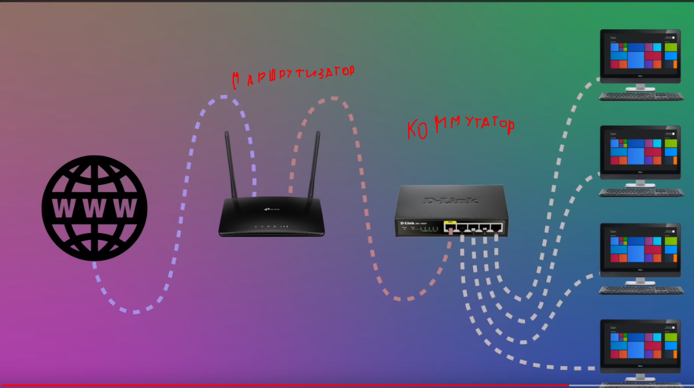{width="6.496527777777778in"
height="3.6319444444444446in"}

### 2 Какую максимальную скорость передачи информации можно получить, используя только 2 пары сетевого провода «витая пара»?**

до 100 Мбит/с

{width="6.496527777777778in"
height="2.2916666666666665in"}

### 3 Создайте соединение патчпанель -- RJ45?

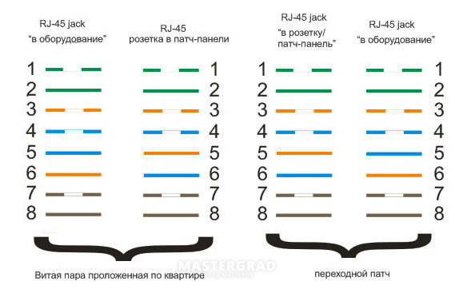{width="5.927083333333333in"
height="3.7708333333333335in"}

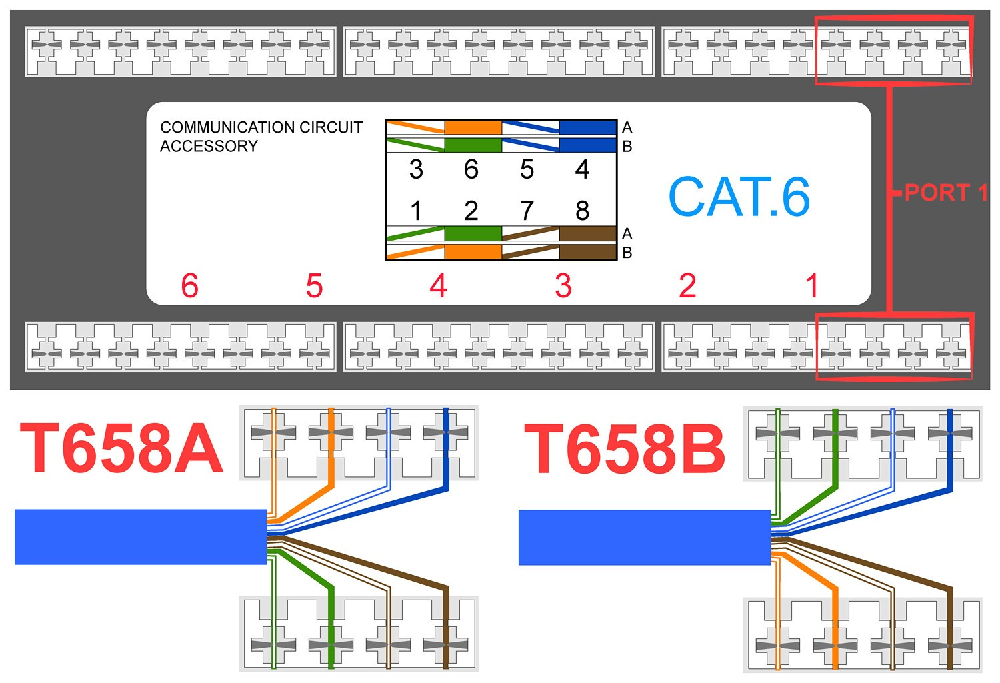{width="6.496527777777778in"
height="4.439583333333333in"}

## ЭКЗАМЕНАЦИОННЫЙ БИЛЕТ №3

### 1 Назначение протокола FTP?

FTP (File Transfer Protocol) -- это протокол, который предназначен **для
передачи файлов через Интернет или локальную компьютерную сеть**. Это
один из самых старых протоколов передачи файлов, который появился еще в
1971 году. Зачем нужен FTP. Основное назначение FTP -- пересылать,
копировать или передавать файлы с удаленного компьютера на локальный и
наоборот. Кроме того при помощи FTP можно работать со своими файлами
прямо на удаленном компьютере.

### 2 Листы доступа, назначение, типы?

**Листы доступа** (Access Control Lists, ACL) - это механизмы управления
доступом, которые определяют, какие пользователи или группы
пользователей имеют право на доступ к определенным ресурсам или
функциям.

**Назначение листов доступа включает:**

1. Ограничение доступа к ресурсам: ACL позволяют ограничить доступ к
    определенным файлам, папкам, сетевым ресурсам и другим объектам.
2. Обеспечение безопасности: ACL помогают обеспечить безопасность
    информации и предотвратить несанкционированный доступ к
    конфиденциальным данным.
3. Управление привилегиями: ACL позволяют администраторам управлять
    привилегиями пользователей, определяя, какие действия они могут
    выполнять с определенными ресурсами.

**Существует несколько типов листов доступа:**

1. **Дискреционные** ACL (DAC): Этот тип ACL основан на правах доступа,
    которые назначаются владельцами ресурсов. Владелец решает, кто имеет
    доступ к ресурсу и какие права доступа у них есть.
2. **Мандатные** ACL (MAC): Этот тип ACL основан на политике
    безопасности, устанавливаемой администратором системы. Права доступа к
    ресурсам определяются на основе классификации данных и уровня
    секретности.
3. **Ролевые** ACL (RBAC): Этот тип ACL основан на назначении прав
    доступа пользователям на основе их роли в организации. Пользователи
    получают доступ к ресурсам в соответствии с их ролью или функцией в
    системе.

### 3 Реализуйте следующую схему с применением DHCP

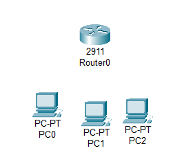{width="0.8506944444444444in"
height="0.7465277777777778in"}

<https://www.youtube.com/watch?v=XPRYaGCkXJ>

## ЭКЗАМЕНАЦИОННЫЙ БИЛЕТ №4

### 1 Приведите три основных пула «серых» ip адресов?

{width="6.496527777777778in"
height="1.4125in"}

\"Серые\" IP-адреса - это диапазоны IP-адресов, которые зарезервированы
для использования в локальных сетях и не маршрутизируются через
Интернет. Некоторые из основных пулов \"серых\" IP-адресов включают:

**1. 10.0.0.0 - 10.255.255.255** (диапазон 10.0.0.0/8) - Самый большой
диапазон \"серых\" IP-адресов, который часто используется в
корпоративных сетях и домашних сетях.

**2. 172.16.0.0 - 172.31.255.255** (диапазон 172.16.0.0/12) - Этот
диапазон также зарезервирован для использования в локальных сетях и
часто используется в средних и крупных организациях.

**3. 192.168.0.0 - 192.168.255.255** (диапазон 192.168.0.0/16) - Этот
диапазон \"серых\" IP-адресов широко применяется в домашних сетях, малых
офисах и других местах, где требуется локальная сеть.

Эти диапазоны \"серых\" IP-адресов предназначены для использования
внутри организаций и не должны маршрутизироваться через Интернет, чтобы
избежать конфликтов с общедоступными IP-адресами.

### 2 Понятие маска сети, короткая и длинная записи ?

**Маска сети** - это комбинация битов, которая используется для
определения, какая часть IP-адреса относится к сети, а какая - к узлу в
этой сети. Маска сети представляет собой последовательность единиц (1)
слева и нулей (0) справа. Единицы обозначают биты, которые относятся к
сети, а нули - к узлу.

**Короткая запись** маски сети представляется в виде числа, которое
указывает количество единиц в маске (например, /24). **Длинная запись**
маски сети представляется в виде четырех чисел, разделенных точками, где
каждое число представляет байт маски (например, 255.255.255.0).

### 3 Реализуйте следующую схему с указанными параметрами?**

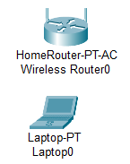{width="0.46944444444444444in"
height="0.5909722222222222in"}

- Пароль должен отвечать требованиям крипто устойчивости
- Должны работать диапазоны 2.4 и 5 Ггц

Сеть 2.4 Ггц должна работать на 5 канале

## ЭКЗАМЕНАЦИОННЫЙ БИЛЕТ №5

### 1 Назначение прямого сетевого кабеля?

**Сетевой кабель** --- это специальный кабель, который применяется для
соединения нескольких компьютерных устройств в одну сеть с возможностью
передачи данных, доступа к другим серверам и оборудованию.

В настоящее время применяются следующие виды сетевого кабеля:

1. **Оптоволоконный кабель**. Информация по нему передаётся не
    электрическим, а световым импульсом.
2. **Витая пара**. Самый распространённый вид сетевого кабеля,
    представляет собой многожильный проводник, состоящий из
    переплетённых между собой в определённой последовательности жил.
3. **Коаксиальный кабель**. Используется для подключения телевидения,
    локальных сетей в видеонаблюдении.

### 2 Назначение кабеля «РоллОвер»?

Кабель \"РоллОвер\" используется для подключения устройств к сетевым
устройствам, таким как маршрутизаторы, коммутаторы или консоли, для
конфигурирования и управления ими. Обычно он используется для
подключения компьютера или ноутбука к консоли управления сетевым
устройством.

### 3 Включите и отключите протокол CDP?

{width="6.522950568678915in"
height="3.5421205161854767in"}

## ЭКЗАМЕНАЦИОННЫЙ БИЛЕТ №6

### 1 Типы беспроводных подключений?

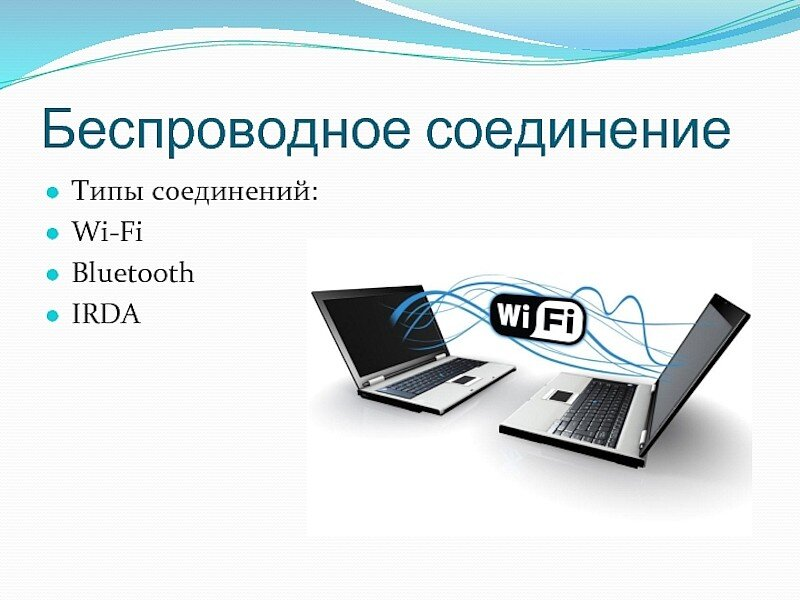{width="6.496527777777778in"
height="4.875694444444444in"}

Существует несколько типов беспроводных подключений, вот некоторые из
них:

1. **Wi-Fi** (беспроводная локальная сеть) - используется для
    подключения устройств к Интернету и другим сетевым ресурсам через
    радиоволновую связь.
2. **Bluetooth** - технология беспроводной связи, которая позволяет
    устройствам обмениваться данными на короткие расстояния.
3. **NFC** (Near Field Communication) - технология беспроводной связи,
    которая позволяет устройствам обмениваться данными на очень близком
    расстоянии (обычно не более 10 см).
4. **ИК-порты** (инфракрасные порты) - используются для беспроводной
    передачи данных между устройствами при помощи инфракрасного излучения.
5. **Zigbee** - стандарт беспроводной связи, который обычно
    используется в системах умного дома и промышленных устройствах для
    передачи данных на короткие расстояния.
6. **Z-Wave** - еще один стандарт беспроводной связи, который также
    используется в системах умного дома для соединения различных устройств и
    датчиков.

### 2 Понятие RAID массив?

**Перевод аббревиатуры RAID** -- «избыточный массив независимых дисков».
Если говорить простым языком, то это дисковый массив, который состоит из
нескольких связанных между собой накопителей. RAID-массив распознается
системой как единое хранение данных вне зависимости от количества и
типов задействованных в нем накопителей.

Есть лекция по RAID

### 3 Создайте соединение патчпанель -- RJ45

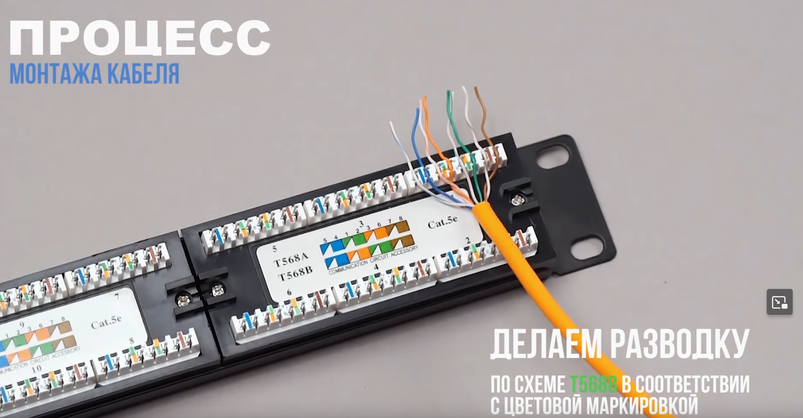{width="6.496527777777778in"
height="3.3895833333333334in"}

**Схема есть в билетах выше**

## ЭКЗАМЕНАЦИОННЫЙ БИЛЕТ №7

### 1 Виды технологий Wi-Fi, различия в производительности и дальности работы?

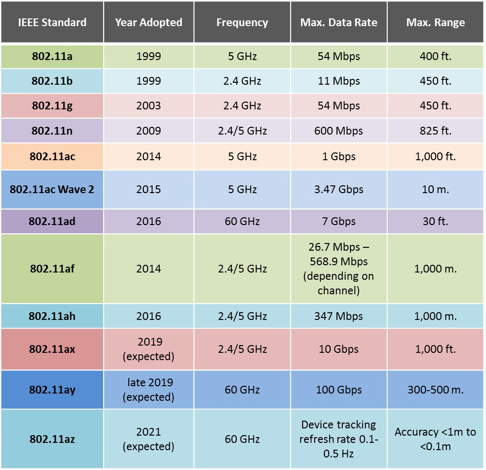{width="6.496527777777778in"
height="6.283333333333333in"}

Технологии Wi-Fi разделяются на несколько поколений, каждое из которых
имеет свои особенности в производительности и дальности работы. Вот
основные виды Wi-Fi технологий и их ключевые характеристики:

- **Wi-Fi 1 (802.11b)**: Первый стандарт, который обеспечивал скорость
    до 11 Мбит/с на частоте 2,4 ГГц. Дальность работы внутри помещений
    достигала до 20 метров. Основным недостатком было наличие помех от
    бытового и промышленного оборудования на частоте 2,4 ГГц.
- **Wi-Fi 2 (802.11a/g)**: Работает на частоте 2,4 ГГц, как и 802.11b,
    но использует более быстрое OFDM стандарта 802.11a, что позволило
    увеличить скорость до 54 Мбит/с. Дальность работы внутри помещений
    достигала до 70 метров.
- **Wi-Fi 3 (802.11n)**: Представляет собой значительное улучшение по
    сравнению с предыдущими стандартами, обеспечивая скорость до 600
    Мбит/с. Использует антенные системы MIMO для улучшения
    производительности и может работать как на частоте 2,4 ГГц, так и на
    5 ГГц, что экономит ресурс батарей у мобильных устройств. Дальность
    работы внутри помещений достигает до 70 метров.
- **Wi-Fi 4 (802.11ac)**: Последний на данный момент стандарт, который
    предлагает еще более высокую скорость передачи данных, достигая до
    1,3 Гбит/с на частоте 5 ГГц. Это позволяет увеличить дальность
    работы и улучшить производительность в условиях больших помещений и
    при большом количестве устройств в сети.

Важно отметить, что производительность и дальность работы Wi-Fi сети
могут значительно варьироваться в зависимости от конкретных условий
использования, таких как количество устройств в сети, наличие
препятствий, помехи от других устройств и т.д.

### 2 Назначение консольного кабеля?

Консольный кабель используется для подключения компьютера или другого
устройства к консольному порту управления устройством, таким как
маршрутизатор, коммутатор или сетевое устройство.

Он позволяет администраторам управлять и настраивать устройство через
командную строку, обеспечивая доступ к его настройкам и функциям.

1. Некоторые маршрутизаторы и устройства (телефонные станции и др) в
    прошлом не имели сетевого интерфейса, только последовательный порт.
2. Консольное подключение безопаснее сетевого
3. В некоторых случаях сеть может быть вообще несконфигурирована, либо
    сконфигурирована таким образом, что нельзя подключиться к админке по
    сети.

### 3 Обожмите кроссовый патчкорд?

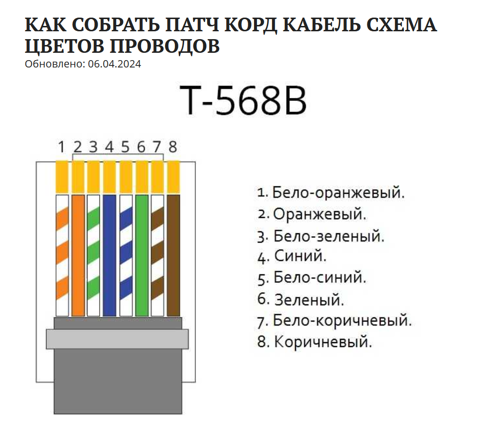{width="6.5602832458442695in"
height="1.334996719160105in"}

## ЭКЗАМЕНАЦИОННЫЙ БИЛЕТ №8

### 1 Опишите процедуру подключения конечного устройства к беспроводной точке доступа?

Для подключения конечного устройства к беспроводной точке доступа
(роутеру) следует выполнить следующие шаги:

1. На конечном устройстве откройте настройки Wi-Fi.
2. Найдите в списке доступных сетей свою беспроводную точку доступа
    (роутер) и нажмите на нее.
3. Если сеть защищена, вам может потребоваться ввести кодовую фразу
    (пароль) для подключения. Кодовая фраза шифрует передаваемые данные,
    обеспечивая безопасность.
4. После ввода кодовой фразы дождитесь установления соединения между
    вашим устройством и роутером.
5. В некоторых случаях может потребоваться совпадение ключей шифрования
    между устройством и роутером для успешного подключения.

После завершения этих шагов ваше конечное устройство будет успешно
подключено к беспроводной точке доступа и готово к использованию
интернета.

Если результаты шифрования сходятся, значит и ключ
шифрования-безопасности был 1 и тот же, пароль подходит, значит можно
авторизовываться

### 2 Назначение DNS службы?

Служба доменных имен (DNS, domain name system) --- это **стандартный
протокол, который позволяет пользователям получать доступ к веб-сайтам,
используя удобочитаемые адреса**.

Как телефонная книга позволяет найти имя контакта и узнать его
телефонный номер, так и DNS позволяет ввести адрес веб-сайта и
автоматически определить его IP-адрес, то есть уникальный идентификатор
конкретного устройства (сервера) в компьютерной сети.

**Служба** **Domain** **Name** **System** необходима для того, чтобы мы
могли без проблем находить свои любимые сайты, не запоминая вереницы
цифр. Итак, вы вводите название сайта в адресную строку и нажимаете
Enter. В те самые секунды, перед тем как сайт отобразится на вашем
экране, **DNS**-серверы работают, не щадя себя

DNS расшифровывается как **Domain Name System** --- система доменных
имен, связывающая текстовые названия ресурсов с их числовыми
IP-адресами.

### 3 Создайте соединение патчпанель -- RJ45?

[**https://www.youtube.com/watch?v=47AFCBe3Hys**](https://www.youtube.com/watch?v=47AFCBe3Hys)

## ЭКЗАМЕНАЦИОННЫЙ БИЛЕТ №9

### 1 Виды RAID-контроллеров?

Существует три вида RAID-контроллеров, основанные на принципах
реализации RAID-массивов:

**1 Программные**, в которых управление массивом ложится на CPU и DRAM
(то есть исполнение программного кода происходит на процессоре)

**2 Интегрированные**, то бишь встроенные в материнские платы ПК или
NAS-сервера

**3 Аппаратные (модульные)**, представляющие собой дискретные платы
расширения для разъемов PCI/PCIe системных плат

### 2 Особенности IPv6?

Основная особенность протокола IPv6 по сравнению с IPv4 --- это длина
адреса в 128 бит вместо 32.

Собственно, это и является причиной перехода, так как количество адресов
в случае с IPv6 будет значительно большим, что позволит расширить
адресное пространство и решит проблему нехватки адресов.

### 3 Обожмите кабель «РоллОвер»?

## ЭКЗАМЕНАЦИОННЫЙ БИЛЕТ №10

### 1 Виды листов доступа?

разделяются на **два типа**:

**Стандартные** (Standard): могут проверять только адреса источников

**Расширенные** (Extended): могут проверять адреса источников, а также
адреса получателей, в случае IP ещё тип протокола и TCP/UDP порты

Обозначаются списки доступа либо номерами, либо символьными именами. ACL
также используются для разных сетевых протоколов.

**Динамический (Dynamic ACL)**

Позволяет сделать следующее, например у вас есть маршрутизатор, который
подключен к какому-то серверу и нам нужно закрыть доступ к нему из
внешнего мира, но в тоже время есть несколько человек, которые могут
подключаться к серверу.

Мы настраиваем динамический список доступа, прикрепляем его на входящем
направлении, а дальше людям, которым нужно подключиться, подключаться
через Telnet к данному устройству, в результате динамический ACL
открывает проход к серверу, и уже человек может зайти скажем через HTTP
попасть на сервер. По умолчанию через 10 минут этот проход закрывается и
пользователь вынужден ещё раз выполнить Telnet чтобы подключиться к
устройству.

**Рефлексивный (Reflexive ACL)**

Здесь ситуация немножко отличается, когда узел в локальной сети
отправляет TCP запрос в Интернет, у нас должен быть открытый проход,
чтобы пришел TCP ответ для установки соединения. Если прохода не будет
--- мы не сможем установить соединение, и вот этим проходом могут
воспользоваться злоумышленники, например проникнуть в сеть. Рефлексивные
ACL работают таким образом, блокируется полностью доступ (deny any) но
формируется ещё один специальный ACL, который может читать параметры
пользовательских сессий, которые сгенерированны из локальной сети и для
них открывать проход в deny any, в результате получается что из
Интернета не смогут установить соединение. А на сессии сгенерированны из
локальной сети будут приходить ответы.

**Ограничение по времени (Time-based ACL)**

Обычный ACL, но с ограничением по времени, вы можете ввести специальное
расписание, которое активирует ту или иную запись списка доступа. И
сделать такой фокус, например пишем список доступа, в котором запрещаем
HTTP-доступ в течении рабочего дня и вешаем его на интерфейс
маршрутизатора, то есть, сотрудники предприятия пришли на работу, им
закрывается HTTP-доступ, рабочий день закончился, HTTP-доступ
открывается,

пожалуйста, если хотите --- сидите в Интернете.

### 2 Причины перехода на IP версии 6?

1. **Неизбежность**. IPv6 скоро станет единственным вариантом
    подключения новых устройств и хостов к интернету.
2. **Эффективность**. IPv6 упрощает и ускоряет передачу данных за счёт
    более эффективной обработки пакетов и отказа от необходимости
    проверять их целостность.
3. **Безопасность**. IPv6 шифрует трафик и проверяет целостность
    пакетов, реализуя для стандартного трафика интернета защиту,
    подобную VPN.
4. Заканчиваются мества на IpV 4

### 3 Создайте в эмуляторе Wi-Fi соединение?

## ЭКЗАМЕНАЦИОННЫЙ БИЛЕТ №11

### 1 Назначение протокола FTP?

FTP (File Transfer Protocol) -- это протокол, который предназначен **для
передачи файлов через Интернет или локальную компьютерную сеть**. Это
один из самых старых протоколов передачи файлов, который появился еще в
1971 году. Зачем нужен FTP. Основное назначение FTP -- пересылать,
копировать или передавать файлы с удаленного компьютера на локальный и
наоборот. Кроме того при помощи FTP можно работать со своими файлами
прямо на удаленном компьютере.

### 2 Каким образом можно назначить IP адрес порту свитча?

Для назначения IP-адреса порту свитча необходимо выполнить следующие
шаги:

1. Подключитесь к свитчу через консольный интерфейс (обычно используется программное обеспечение для работы по протоколу SSH или Telnet).
2. Зайдите в режим настройки интерфейса командой configure terminal.
3. Выберите интерфейс, которому хотите назначить IP-адрес, например, interface GigabitEthernet0/1.
4. Назначьте IP-адрес командой ip address <IP-адрес> <маска подсети>.
5. Включите интерфейс командой no shutdown.
6. Сохраните изменения командой write memory или copy running-config startup-config.

### 3 Создайте прямой патчкорд?

## ЭКЗАМЕНАЦИОННЫЙ БИЛЕТ №12

### 1 Основные характеристики маршрутизатора?

Основные технические характеристики маршрутизатора связаны с тем, как он
решает свою главную задачу - маршрутизацию пакетов в составной сети.
Именно эти характеристики прежде всего определяют возможности и сферу
применения того или иного маршрутизатора.

Маршрутизация в сетях связи --- это процесс определения оптимального
маршрута данных.

Маршрутизация служит для приема пакета от одного устройства и передачи
его по сети другому устройству через другие сети. Если в сети нет
маршрутизаторов, то не поддерживается маршрутизация. Маршрутизаторы
направляют (перенаправляют) трафик во все сети, составляющие
объединенную сеть.

{width="6.2in" height="3.28in"}

**Основные характеристики маршрутизатора:**

- тип: одно- или многопротокольный, LAN или WAN, Brouter
- поддерживаемые протоколы
- пропускная способность
- типы подключаемых сетей
- поддерживаемые интерфейсы (LAN и WAN)
- количество портов
- возможность управления и мониторинга сети

### 2 Приведите классификацию типов угроз WLAN ?

**Подслушивание**. Организуется двумя способами: перехват радиосигнала
(анонимное подслушивание) и при помощи MITM-атаки («человек
посередине»).

**DDoS-атаки**. При их организации сигналы точек доступа и клиентских
терминалов просто глушатся.

**Подмена MAC-адресов клиентских устройств**. Злоумышленники подменяют
MAC-адрес своего устройства, выдавая его за уже зарегистрированное в
сети, и получают к ней доступ.

**Ложные точки доступа (атака Evil Twin)**. Организуются с целью сбора
аутентификационных данных с устройств для подключения к конкретной сети.

**1. Пассивные угрозы:**

**- Прослушивание** (eavesdropping): злоумышленник может перехватывать и
анализировать передаваемые данные без их изменения.

**- Мониторинг** (monitoring): злоумышленник может наблюдать за
активностью в сети WLAN без вмешательства.

**2. Активные угрозы:**

**- Подделка** (spoofing): злоумышленник может подделывать адреса MAC
или другие идентификационные данные для доступа к сети.

**- Отказ в обслуживании** (denial of service): злоумышленник может
перегружать сеть или отключать устройства, чтобы нарушить работу сети.

**3. Угрозы конфиденциальности:**

**- Несанкционированный доступ к данным:** злоумышленник может получить
доступ к конфиденциальным данным, передаваемым по сети WLAN.

**- Утечка информации:** несанкционированный доступ к данным может
привести к их утечке или краже.

**4. Угрозы целостности:**

**- Модификация данных:** злоумышленник может изменять передаваемые
данные, что может привести к ошибкам или потере информации.

**- Внедрение вредоносного кода:** злоумышленник может внедрить
вредоносное ПО в сеть WLAN для нанесения ущерба устройствам или данным.

**5. Угрозы аутентификации:**

**- Подделка идентификационных данных:** злоумышленник может попытаться
подделать учетные данные для получения доступа к сети WLAN.

**- Атаки на протоколы аутентификации:** злоумышленник может
использовать уязвимости в протоколах аутентификации для обхода
механизмов защиты.

## ЭКЗАМЕНАЦИОННЫЙ БИЛЕТ №13

### 1 Цель создания протокола CDP?

Протокол CDP (Cisco Discovery Protocol) был создан для обеспечения
сетевой автоматизации и упрощения процесса управления сетью. Его целью
является обнаружение и предоставление информации о соседних устройствах
в сети, таких как маршрутизаторы, коммутаторы и другие устройства Cisco.
Протокол CDP позволяет администраторам получать информацию о соседних
устройствах, их конфигурации и статусе, что помогает в управлении и
мониторинге сети.

### 2 Назначение технологии VLAN?

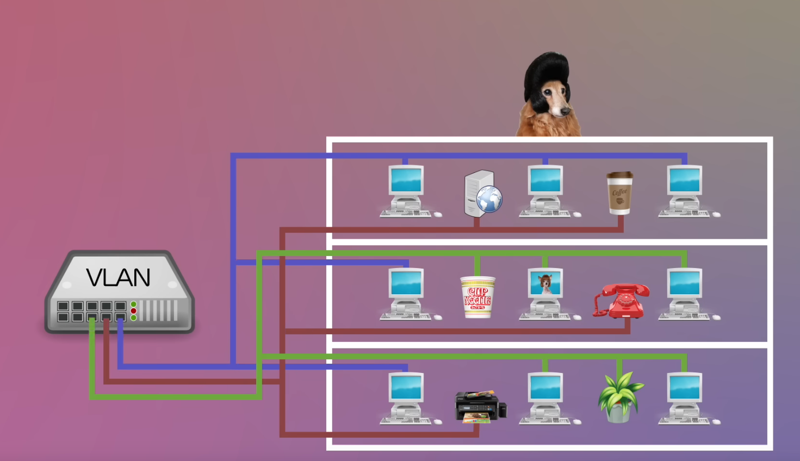{width="6.496527777777778in"
height="3.745138888888889in"}

Технология VLAN (Virtual Local Area Network) используется для разделения
сети на логические сегменты, которые могут взаимодействовать друг с
другом, как если бы они были физически разделены. Назначение технологии
VLAN включает в себя:

**1. Увеличение безопасности:** VLAN позволяет ограничить доступ к
определенным сегментам сети, что уменьшает риск несанкционированного
доступа к данным.

**2. Улучшение производительности:** Позволяет разделять трафик на
сегменты, что помогает уменьшить загруженность сети и повысить ее
производительность.

**3. Упрощение управления:** Позволяет администраторам управлять сетью
более эффективно и гибко, настраивая виртуальные группы в соответствии с
требованиями бизнеса.

**4. Оптимизация использования ресурсов:** Позволяет группировать
устройства по функциональным или логическим параметрам, что способствует
более эффективному использованию сетевых ресурсов.

### 3 В эмуляторе создайте соединение роутер-компьютер по FTP?

## ЭКЗАМЕНАЦИОННЫЙ БИЛЕТ №14

### 1 Назовите минимальный набор аппаратных средств для организации сети?

Для организации сети минимальный набор аппаратных средств включает в
себя:

1. Маршрутизатор или коммутатор для управления трафиком в сети.
2. Кабели Ethernet для соединения устройств в сети.
3. Сетевые адаптеры для каждого устройства, которое нужно подключить к сети.
4. ПК или сервер для настройки и управления сетью.

Этот минимальный набор позволит создать базовую локальную сеть (LAN) для
обмена данными между устройствами.

### 2 Топология множественная звезда, основные преимущества?

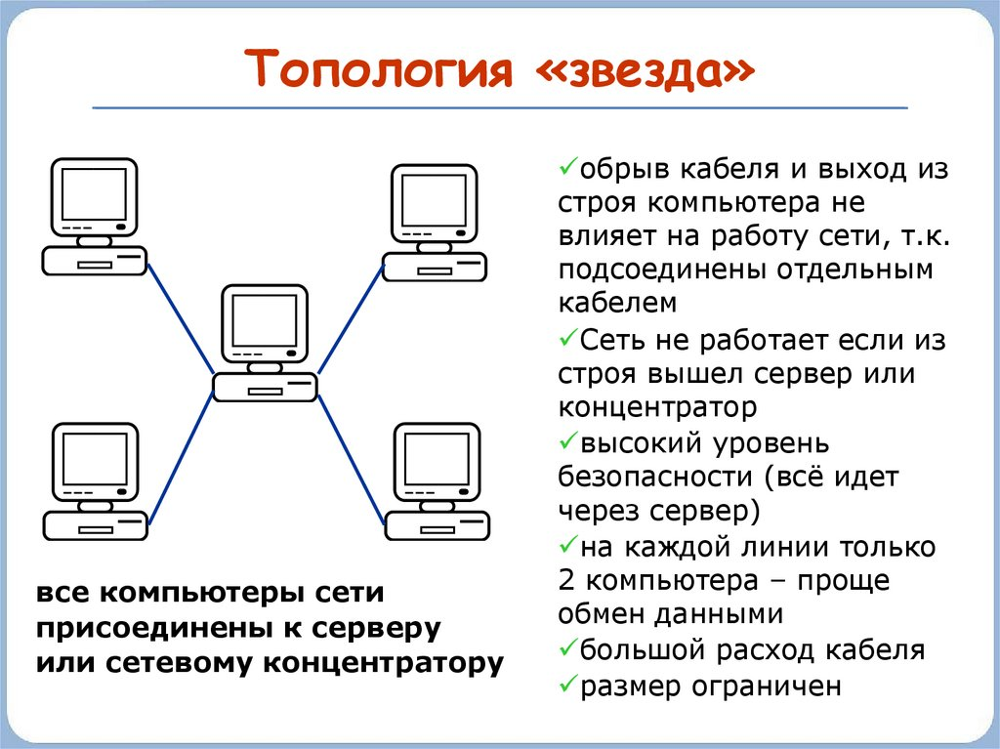{width="6.4951312335958in" height="4.0in"}

**Главными плюсами топологии звезда можно считать:**

Разрыв кабеля или выход из строя любого хоста, кроме центрального, не
сказывается на работе всей ЛВС;

Легкая локализация неисправностей;

Высокая скорость передачи данных между хостами ЛВС;

К недостаткам можно отнести:

Высокую стоимость при внедрении;

Отказ центрального устройства сделает локальную сеть недоступной.

### 3 Реализуйте следующую схему с применением DHCP?

## ЭКЗАМЕНАЦИОННЫЙ БИЛЕТ №15

### 1 Опишите основные отличия гостевой Wi-Fi сети от постоянной?

По сути, это отдельная точка доступа на вашем роутере. Все ваши домашние
устройства подключены к одной точке и объединены в сеть, а гостевая сеть
--- это другая точка, из которой можно получить доступ к Интернету, но
невозможно попасть в вашу домашнюю сеть. Гостям можно предложить
подключиться именно к ней.

В результате друзья и знакомые не потеряют связь с внешним миром и при
этом не поставят под угрозу ваши данные.

1. Доступ: Гостевая Wi-Fi сеть предназначена для временного доступа для
    гостей или посетителей, в то время как постоянная Wi-Fi сеть
    используется для постоянного доступа для владельцев и сотрудников
    организации.
2. Безопасность: Гостевая Wi-Fi сеть обычно имеет более ограниченные
    права доступа и меньше возможностей для пользователей, чем постоянная
    Wi-Fi сеть, чтобы защитить основную сеть от угроз безопасности.
3. Скорость: Постоянная Wi-Fi сеть обычно имеет более высокую скорость
    и пропускную способность, чем гостевая Wi-Fi сеть, так как она
    предназначена для использования владельцами и сотрудниками организации.
4. Контроль доступа: Гостевая Wi-Fi сеть может быть настроена таким
    образом, чтобы ограничить доступ к определенным ресурсам или сайтам, в
    то время как постоянная Wi-Fi сеть обычно предоставляет полный доступ к
    ресурсам организации.
5. Легкость настройки: Гостевая Wi-Fi сеть обычно проще настраивается и
    управляется, чем постоянная Wi-Fi сеть, так как она предназначена для
    временного использования и не требует сложной конфигурации.

**2 Нестандартные виды RAID технологий, приведите пример, опишите
принцип работы?**

#### «RAID 7»

Нестандартный уровень «RAID», торговая марка которого принадлежит
компании «Storage Computer Corporation». Массив конструктивно исполнен
на основе базовых уровней «RAID 3» и «RAID 4» с добавлением операции
кеширования. «RAID 7» включает в себя встроенную операционную систему
реального времени в качестве контроллера, ответственную за запуск кода
для исполнения заложенных функций, кеширование по высокоскоростной шине
с использованием оперативной памяти и другие характеристики для
управления доступом к диску и потоком данных.

#### Адаптивный «RAID»

Данный вариант организационного построения массива
наделяет «RAID-контроллер» приоритетным правом определять порядок
сохранения четности на дисках. Принятие решения будет основываться на
сравнении двух уровней «RAID 3» и «RAID 5», и напрямую зависеть от того,
какой тип «RAID-набора» будет работать лучше с типом данных,
записываемых на диски.

#### «Linux MD RAID 10»

Предлагаемый уровень, предоставляемый ядром «Linux», поддерживает
создание комбинированных и нестандартных «RAID-массивов» и позволяет
управлять «RAID-устройствами» с помощью соответствующего прикладного
функционального инструментария. Программный «RAID» для «Linux» также
может поддерживать создание стандартных конфигураций, таких как «RAID
0», «RAID 1», «RAID 4», «RAID 5» и «RAID 6».

### 3 Создайте прямое подключение?

## ЭКЗАМЕНАЦИОННЫЙ БИЛЕТ №16

### 1 Основные уровни модели OSI

{width="6.496527777777778in"
height="8.00763888888889in"}

**Сетевой инженер работает с первыми 5, остальные к разрабам софта**

**1 физичекский** -- на уровне проводов (изернет например)

**2 канальный уровень** - кодирование в биты и первые MAC адреса
(коммутаторы и мосты на этом уровне + изернет)

**3 Сетевой уровень** -- маршрутизация трафика, работа с IP, Пакеты
(маршрутизатор на этом урвоне)

**4 Транспортный уровень** -- обеспечивет передачу данных от отправителя
к получателю (TCP и UDP)

**5 Сеансовый уровень** -- управляет сессиям, он разрывает сессии

**6 Уровень представления** -- Кодирование и сжатие (на примере фоток)

**7 Уровень приложений** -- HTTP, HTTPS (для доступа сёрфа, и уже для
работы пользователей)

### 2 Приведите примеры ситуаций, когда необходимо настроить VLAN на свитче?

**1. Разделение трафика в корпоративной сети:** VLAN позволяют разделять
трафик различных отделов компании для обеспечения безопасности и
улучшения производительности сети.

**2. Изоляция гостевого трафика:** VLAN позволяют создать отдельную сеть
для гостевых устройств, чтобы предотвратить доступ к корпоративным
ресурсам.

**3. Управление трафиком в центральных узлах сети:** VLAN позволяют
оптимизировать трафик и управлять его потоками на центральных
коммутаторах.

**4. Сегментация сети для повышения безопасности:** VLAN позволяют
создать отдельные сегменты сети для разных типов устройств, чтобы
минимизировать риск атак и утечек данных.

**5. Поддержка виртуализации:** VLAN используются для создания
виртуальных сетей в виртуализированных средах, что помогает управлять и
изолировать сетевой трафик между виртуальными машинами.

### 3 Реализуйте следующую схему с указанными параметрами?

## ЭКЗАМЕНАЦИОННЫЙ БИЛЕТ №17**

### 1 Перечислите виды RAID массивов. Опишите особенности RAID 5?

RAID 0, RAID 1, RAID 2, RAID 3, RAID 4, RAID 5, RAID 6, «RAID 10» («RAID
1 + 0»), «RAID 01» («RAID 0 + 1»), «RAID 03» («RAID 0 + 3»), «RAID 50» (
«RAID 5 + 0»), есть ещё нестандартные

**RAID** **5** - наиболее часто используемый уровень RAID, использующий
чередование для разделения данных на нескольких дисках и четность для
восстановления недостающих данных на основе информации с других дисков.
Именно комбинация различных физических дисков помогает распределять
данные и информацию о четности по всем интегрированным дискам, что
отличает **RAID** **5** от других уровней.

Основным недостатком уровней RAID от 2-го до 4-го является невозможность
производить параллельные операции записи, так как для хранения
информации о чётности используется отдельный контрольный диск. RAID 5 не
имеет этого недостатка. Блоки данных и контрольные суммы циклически
записываются на все диски массива, нет асимметричности конфигурации
дисков. **Доп инфа в 20 билете**

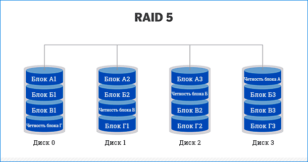{width="6.35625in"
height="3.347916666666667in"}

### 2 Опишите процедуру подключения конечного устройства к беспроводной точке доступа?**

Смотри билет 8

### 3 В эмуляторе создайте соединение роутер-компьютер по FTP?

## ЭКЗАМЕНАЦИОННЫЙ БИЛЕТ №18

### 1 Назначение каналов в сети Wi-Fi?

В сети Wi-Fi используются два диапазона частот --- 2,4 и 5 ГГц. Они
отличаются характеристиками и предназначены для решения разных задач.

1. **2,4 ГГц.** Этот диапазон охватывает частоты от 2412 до 2472 МГц и
    делится на 14 каналов, по которым передаются данные между роутером и
    подключенным устройством. На практике используется только 13 из них.
    Каждый канал охватывает небольшую часть диапазона. Его ширина --- 20
    МГц.
2. **5 ГГц.** Этот диапазон охватывает частоты от 5160 до 5825 МГц. В
    России он делится на 33 канала шириной 20 МГц, и 19 из них не
    пересекаются между собой.

Каналы в сети Wi-Fi используются для разделения радиочастотного спектра,
что позволяет устройствам избегать интерференции и конфликтов при
передаче данных. Назначение каналов в сети Wi-Fi заключается в
обеспечении более эффективной работы сети, улучшении скорости передачи
данных и уменьшении помех от других беспроводных устройств. Выбор
оптимального канала может помочь улучшить производительность вашей сети
Wi-Fi.

{width="6.496527777777778in"
height="1.5638888888888889in"}

### 2 Основные характеристики маршрутизатора?

Смотри билет 1

### 3 Обожмите кабель «РоллОвер»

## ЭКЗАМЕНАЦИОННЫЙ БИЛЕТ №19

### 1 Объясните причины отказа от технологии RAID 2?

Данная конфигурация хранилища данных использует чередование дисков, в
дополнение к которому выделены некоторые отдельные диски, хранящие
информацию о проверке и исправлении ошибок («ECC»). Данный код
исправления ошибок позволяет производить анализ данных, которые
считываются или пересылаются, и, при необходимости, исправлять их
непосредственно во время процесса передачи. «RAID 2» также использует
выделенную четность кода Хемминга для обнаружения и коррекции ошибок. Но
поскольку современные жесткие диски также используют само
контролирующийся код Хемминга, то уровень «RAID 2» теперь считается
устаревшим. В дополнение стоит отметить, что «RAID 2» не имеет
преимуществ перед следующим вариантом организации дискового
массива «RAID 3», и поэтому больше не используется.

Отказ от технологии RAID 2 обычно обусловлен несколькими причинами:

**1. Сложность и сложность реализации:** RAID 2 требует использования
битовых уровней коррекции ошибок (ECC), что усложняет процесс реализации
и поддержки системы хранения данных.

**2. Низкая эффективность:** RAID 2 предоставляет избыточность данных на
уровне бита, что может быть излишним для многих приложений и приводить к
низкой эффективности использования дискового пространства.

**3. Низкая производительность:** из-за сложности метода коррекции
ошибок и необходимости использования дополнительных дисков для хранения
информации о коррекции, RAID 2 может иметь низкую производительность по
сравнению с более современными методами RAID.

**4. Недостаточная поддержка:** из-за отсутствия широкой поддержки и
распространенности RAID 2, его использование может быть затруднено в
современных системах хранения данных.

Из-за этих причин многие организации предпочитают более современные и
эффективные методы RAID, такие как RAID 5, RAID 6 или даже новые
технологии хранения данных, которые обеспечивают более высокую
производительность, надежность и эффективность.

### 2 Понятие EtherChannel, принцип работы технологии?

EtherChannel - это технология в сетях Ethernet, которая позволяет
объединить несколько физических соединений между двумя устройствами в
один логический канал. Это позволяет увеличить пропускную способность и
надежность сети.

Принцип работы технологии EtherChannel заключается в том, что несколько
физических интерфейсов объединяются в один логический канал, который
рассматривается как единое соединение. При этом используется алгоритм
балансировки нагрузки, который распределяет трафик между физическими
интерфейсами в зависимости от настроек.

Таким образом, EtherChannel повышает пропускную способность и надежность
сети, а также обеспечивает более эффективное использование ресурсов.

Технология позволяет объединять несколько физических каналов Ethernet в
один логический для увеличения пропускной способности и повышения
надёжности соединения. 

### 3 Реализуйте следующую схему с указанными параметрами ?

## ЭКЗАМЕНАЦИОННЫЙ БИЛЕТ №20

### 1 Контроль чётности: опишите понятие и принцип работы в RAID 5?

**RAID 5** - это технология, которая работает на принципах чётности и
чередования. Она считается одной из наиболее распространённых и
безопасных.

Для создания RAID 5 необходимо иметь не менее 3 дисков. Максимальный
объём - 16 накопителей.

Во время записи данные разделяются по блокам. При этом на один из
дисков, именуемый блоком чётности (Parity Drive/PD), пишется информация
для дальнейшего восстановления.

**Преимущества RAID 5:**

--- Увеличение скорости линейного чтения, поскольку данные берутся сразу
с нескольких потоков массива.\
--- Информация не потеряется, если из строя вышел один или несколько
дисков.\
--- При замене одного из накопителей данные восстановятся автоматически
из-за особенностей алгоритма работы RAID.

**Недостатки RAID 5:**

--- Изредка случаются отказы дисков.\
--- Процесс восстановления данных крайне нетороплив.\
--- Требуется не менее 3 накопителей, чтобы завести массив.

### 2 Приведите классификацию типов угроз WLAN?

Смотри билет 12

### 3 Создайте соединение патчпанель -- RJ45?

**ЭКЗАМЕНАЦИОННЫЙ БИЛЕТ №21**

**1 Опишите принцип работы «Wi-Fi точки двойника» и методы защиты от
такой угрозы?**

«Wi-Fi точка двойника» (Wi-Fi honeypot) - это ложная точка доступа
Wi-Fi, созданная злоумышленником с целью привлечь пользователей и
получить их личные данные, пароли или другую конфиденциальную
информацию. Принцип работы заключается в том, что злоумышленник создает
точку доступа с таким же названием (SSID) и параметрами, как у реальной
точки доступа, чтобы пользователи не подозревали обмана и подключались к
ложной сети.

**Методы защиты от «Wi-Fi точки двойника» включают в себя следующие
шаги:**

1\. Внимательно проверяйте название (SSID) точки доступа Wi-Fi перед
подключением. Проверьте правильность написания и возможные отличия от
известной точки доступа.

2\. Используйте виртуальные частные сети (VPN) для шифрования
интернет-трафика и защиты своих данных от перехвата.

3\. Обновляйте программное обеспечение на устройствах, чтобы устранить
уязвимости, которые могут быть использованы злоумышленниками для атак.

4\. Ограничьте автоматическое подключение к открытым сетям Wi-Fi и
предпочтительно подключайтесь только к защищенным сетям с использованием
WPA2 или WPA3 шифрования.

5\. Используйте антивирусное программное обеспечение на устройствах для
обнаружения и блокировки потенциальных угроз.

Соблюдение этих мер поможет защитить вас от атак через «Wi-Fi точку
двойника» и обеспечит безопасность вашей личной информации при
использовании общедоступных Wi-Fi сетей.

**2 Технология RAID 4, особенности работы?**

Данная конфигурация массива «RAID» использует выделенный диск четности и
чередование на уровне блоков между несколькими дисками, что позволяет
пользователям осуществлять операции чтения записей с любого отдельного
диска. Однако, поскольку все записи должны идти на выделенный диск
четности, производительность данного процесса существенно снижена.
Варианты «RAID 4», а также представленные ранее «RAID 3» и «RAID 2» в
современных системах обычно не используются.

**RAID 4** --- это отказоустойчивый массив независимых дисков с
разделяемым диском чётности.

**Особенности работы:**

1.  Расслоение данных происходит на уровне секторов, а не на уровне
    битов и байтов.

2.  Более высокая производительность передачи малых объёмов данных за
    счёт распараллеливания, при котором имеется возможность выполнять
    более одного обращения по I/O контуру одновременно.

**Преимущества:**

-   очень высокая скорость чтения данных больших объёмов;

-   высокая производительность при большой интенсивности запросов чтения
    данных;

-   малые накладные расходы для реализации избыточности.

**Недостатки:**

-   достаточно сложная реализация;

-   очень низкая производительность при записи данных;

-   сложное восстановление данных;

-   низкая скорость чтения данных малого объёма при единичных запросах;

-   асимметричность быстродействия относительно чтения и записи.

**ЭКЗАМЕНАЦИОННЫЙ БИЛЕТ №22**

**1 Основные характеристики маршрутизатора?**

Смотри билет 1

**2 Отличие «белого» ip адреса от «серого»?**

Смотр билет 1

**3 Создайте прямой патчкорд?**

**ЭКЗАМЕНАЦИОННЫЙ БИЛЕТ №23**

**1 Топология множественная звезда, основные преимущества?**

Смотри билет 14

**2 Опишите принцип работы «Wi-Fi точки двойника» и методы защиты от
такой угрозы?**

Смотри билет 21

**3 Обожмите кабель «РоллОвер»?**

**ЭКЗАМЕНАЦИОННЫЙ БИЛЕТ №24**

**1 Технология гибридного RAID массива, особенности работы?**

Некоторые уровни «RAID» относятся, согласно установленной классификации,
к категории комбинированных «RAID». Данные образцы организационного и
конструктивного построения запоминающих устройств в формате единого
массива представляют собой вариативное сочетание уже существующих
базовых уровней «RAID». И далее мы рассмотрим несколько примеров
распространенных и популярных комбинированных массивов.

\-\-\-\-\-\-\-\-\-\-\-\-\-\-\-\-\-\-\-\-\-\-\-\-\-\-\-\-\-\-\-\-\-\-\-\-\-\-\-\-\-\-\-\-\-\-\-\-\-\-\-\-\-\-\-\-\-\-\-\-\-\-\-\-\-\-\-\-\-\-\-\-\-\-\-\-\-\-\-\-\-\-\-\-\-\-\-\-\-\-\-\-\-\-\-\-\-\-\--

Гибридный RAID (также известный как RAID 10 или RAID 1+0) является
комбинацией двух уровней RAID: RAID 1 (зеркалирование) и RAID 0
(стрипинг). В гибридном RAID данные делятся на блоки, которые
зеркалируются на два или более дисках (уровень RAID 1), а затем эти
зеркала объединяются в массив с использованием стрипинга (уровень RAID
0).

Особенности работы гибридного RAID включают:

1\. Высокая скорость чтения и записи: благодаря комбинации
зеркалирования и стрипинга, гибридный RAID обеспечивает высокую скорость
доступа к данным.

2\. Высокая отказоустойчивость: благодаря зеркалированию данных,
гибридный RAID обеспечивает защиту от потери данных в случае отказа
одного или нескольких дисков.

3\. Эффективное использование места на диске: гибридный RAID
обеспечивает баланс между отказоустойчивостью и производительностью, что
делает его привлекательным выбором для организаций, требующих высокую
производительность и защиту данных.

4\. Возможность расширения массива: гибридный RAID позволяет легко
добавлять новые диски к массиву для увеличения емкости или
производительности.

5\. Сложность настройки и управления: из-за комбинации двух уровней
RAID, гибридный RAID может быть сложным в настройке и управлении по
сравнению с более простыми уровнями RAID, такими как RAID 0 или RAID 1.

**2 Основная сфера применения RIPng?**

Основная сфера применения RIPng (RIP next generation) - это
маршрутизация в IPv6 сетях. RIPng является адаптацией протокола RIP
(Routing Information Protocol) для работы с IPv6 адресами. Он
используется для обмена информацией о маршрутах между маршрутизаторами в
IPv6 сетях и обеспечивает динамическую маршрутизацию в таких сетях.
RIPng может быть использован в различных типах сетей, но его основное
применение - это в IPv6 сетях, где требуется простой и надежный протокол
маршрутизации

**3 Создайте прямое подключение с применением IPv6?**

**ЭКЗАМЕНАЦИОННЫЙ БИЛЕТ №25**

**1 Приведите классификацию типов угроз WLAN?**

Cмотри билет 12

**2 Преимущества RAID 01 над RAID 10?**

1\. Лучшая производительность записи данных: RAID 01 обеспечивает более
высокую производительность при записи данных, так как данные
записываются параллельно на два набора дисков.

2\. Улучшенная отказоустойчивость: RAID 01 имеет более высокий уровень
отказоустойчивости в случае сбоя одного диска в каждом из массивов,
поскольку данные остаются доступными на другом наборе дисков.

**3 В эмуляторе создайте соединение роутер-компьютер по FTP?**

**ЭКЗАМЕНАЦИОННЫЙ БИЛЕТ №26**

**1 Понятие EtherChannel, принцип работы технологии?**

Смотри билет 19

**2 Опишите процедуру подключения конечного устройства к беспроводной
точке доступа ?**

Смотри билет 8

**3 Реализуйте следующую схему с применением DHCP?**
