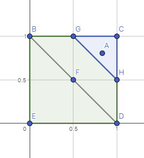
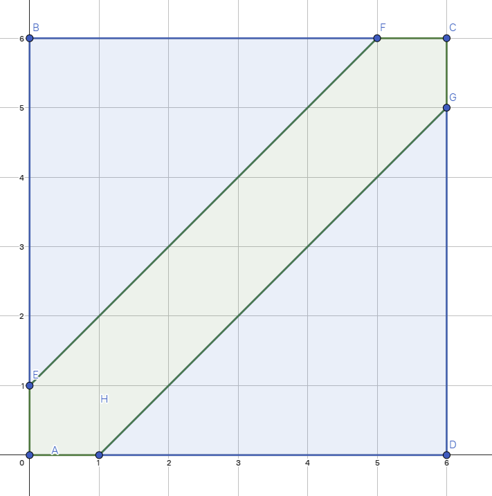

# Практическая работа 

## Задача 34

### Условие задачи

На единичном квадрате (с вершинами $(0;0), (0;1), (1;0), (1;1)$ )
случайным образом выбирается точка $А = (x; у)$.
«Случайным» означает, что каждая координата точки равномерно
распределена в интервале $(0;1)$. Найдите вероятность того, что
точка $А$ будет ближе к точке $(1;1)$, нежели к точке
$(\frac{1}{2};\frac{1}{2})$.

### Решение задачи

Составим график:



<!-- $BCDE$ - это квадрат к который попадает наша точка $A$ -->

$F$ - точка $(\frac{1}{2};\frac{1}{2})$

$C$ - точка $(1;1)$

Общая площать: $S = 1$

<!-- Ближайшее расстояние до точки - это перпендикуляр, значит линия $GH$ - это линия, по которой расстояния будут равны.

Облась, зарисованная синим $(S_{GCH})$- это область благоприятных событий

Облась, зарисованная зелёным $(S_{BGHDE})$ - это облась неблагоприятных событий

Не трудно вычислить площади этих фигур: -->

$$
S_{BGHDE} = 0.125
$$

$$
S_{GCH} = 0.875
$$

<!-- Согласно закону, вероятность события равна отношению благоприятных событий к
общему количеству событий. Соответственно применяя это правило к геометрии получим,
что нужно поделить благоприятную площать, на общую -->

$$
P = \frac{S_{благ}}{S_{общ}} = \frac{0.125}{1} = 0.125
$$

### Ответ

$$
P = \frac{S_{благ}}{S_{общ}} = \frac{0.125}{1} = 0.125
$$

### Проверка

<!-- Применим метод Монте-Карло для проверки задания: -->

```python
import random
import math

N = 10 ** 6 # Количество эксперементов
n = 0       # Количество благоприятных случаев
P_formula = 0.125   # Вероятность по формуле

F = 1/2 # Не благоприятная точка
C = 1   # Благоприятная точка

for _ in range(N):
    x = random.uniform(0, 1)
    y = random.uniform(0, 1)

    lengthF = math.sqrt((x - F) ** 2 + (y - F) ** 2)
    lengthC = math.sqrt((x - C) ** 2 + (y - C) ** 2)
    if lengthF > lengthC:
        n = n + 1


P_result = n / N

print("Проверено последовательностей: ", N)
print("Успешных последовательностей n: ", n)
print("")
print("Приближенное отношение:", '{:.90f}'.format(P_result))
print("Вероятность по формуле:", '{:.90f}'.format(P_formula))
print("")
print("Абсолютное расхождение:", '{:.90f}'.format(abs(P_result - P_formula)))
print("Отноосительное расхождение:", '{:.90f}'.format(abs(P_result - P_formula) / P_formula * 100))
```

<!-- Проверим наш скрипт:

```bash
>>> python test.py
Проверено последовательностей:  1000000
Успешных последовательностей n:  124595

Приближенное отношение: 0.124594999999999997419841690771136200055480003356933593750000000000000000000000000000000000
Вероятность по формуле: 0.125000000000000000000000000000000000000000000000000000000000000000000000000000000000000000

Абсолютное расхождение: 0.000405000000000002580158309228863799944519996643066406250000000000000000000000000000000000
Отноосительное расхождение: 0.324000000000002064126647383091039955615997314453125000000000000000000000000000000000000000
``` -->

## Задача 35

### Условие задачи

Задача о встрече. Два человека $А$ и $В$ договорились
о встрече между $7$ и $8$ часами вечера. Но оба забыли точное
время и приходят между $7$ и $8$ часами «случайным образом»
и ждут не более $10$ минут. Найдите вероятность встречи.

### Решение задачи

Составим график, где 1 деление = 10 минутам

Используем формулу:

$$
y - 1 < x < y + 1
$$

т.е. мы ограничиваем время между двумя людьми 1 делением или 10 минутами



Получаем, квадрат событий где он описывается уравнением $$

Складывая квадраты и треугольники не трудно вычислить площади:

$$
S_{AEFCGH} = 11
$$

$$
S_{EBF} + S_{HGD} = 25
$$

<!-- Согласно закону, вероятность события равна отношению благоприятных событий к
общему количеству событий. Соответственно применяя это правило к геометрии получим,
что нужно поделить благоприятную площать, на общую -->

$$
P = \frac{S_{благ}}{S_{общ}} = \frac{11}{36} = 0.3056
$$

### Ответ

$$
P = \frac{S_{благ}}{S_{общ}} = \frac{11}{36} = 0.3056
$$

### Проверка

<!-- Применим метод Монте-Карло для проверки задания: -->

```python
import random
import math

N = 10 ** 6 # Количество эксперементов
n = 0       # Количество благоприятных случаев
P_formula = 0.3056 # Вероятность по формуле


for _ in range(N):
    x = random.uniform(0, 6)
    y = random.uniform(0, 6)

    if y - 1 < x and x < y + 1:
        n = n + 1

P_result = n / N

print("Проверено последовательностей: ", N)
print("Успешных последовательностей n: ", n)
print("")
print("Приближенное отношение:", '{:.90f}'.format(P_result))
print("Вероятность по формуле:", '{:.90f}'.format(P_formula))
print("")
print("Абсолютное расхождение:", '{:.90f}'.format(abs(P_result - P_formula)))
print("Отноосительное расхождение:", '{:.90f}'.format(abs(P_result - P_formula) / P_formula * 100))
```

<!--Проверим наш скрипт:

```bash
>>> python test.py
Проверено последовательностей:  10000000
Успешных последовательностей n:  3053175

Приближенное отношение: 0.3053175000000000194333438230387400835752
Вероятность по формуле: 0.3055999999999999827693386578175704926252

Абсолютное расхождение: 0.0002824999999999633359948347788304090500
Отноосительное расхождение: 0.0924410994764277987867373553854122292250
``` -->

## Задача 36

### Условие задачи

Два игрока $А$ и $В$ поочередно бросают пару костей.
Игрок $А$ выигрывает, если он наберет $6$ очков перед тем, как
игрок $В$ наберет $7$ очков. (В противном случае выигрывает
игрок $В$). Какова вероятность того, что выигрывает игрок $А$,
если он первым начинает игру?

### Решение задачи


### Ответ


### Проверка


## Задача 37

### Условие задачи

Два сухогруза должны подойти к одному и тому
же причалу. Время их прихода независимо и равновозможно
в течение данных суток. Определите вероятность того, что
одному из сухогрузов придется ожидать причала, если время
стоянки первого сухогруза — $1$ час, а второго — $2$ часа. 


### Решение задачи


### Ответ


### Проверка


## Задача 38

### Условие задачи

Три теплохода должны подойти к одному и тому
же причалу. Время прихода теплоходов независимо и
равновозможно в течение данных суток. Определите вероятность
того, что хотя бы одному из теплоходов придется ожидать
причала, если время стоянки каждого теплохода — $1$ час. 

### Решение задачи


### Ответ


### Проверка


## Задача 39

### Условие задачи

Вероятность какого события больше: получить
по крайней мере две шестерки при подбрасывании $12$ костей,
или получить по крайней мере три шестерки подбрасывании
$18$ костей? 


### Решение задачи


### Ответ


### Проверка


## Задача 40

### Условие задачи

Найдите вероятность того, что при последовательном
бросании кости серия из трех единиц появится раньше серии
из четырнадцати «неединиц». 

### Решение задачи


### Ответ


### Проверка


## Задача 41

### Условие задачи

Из ящика, содержащего $8$ белых и $5$ черных шаров,
вынимают наудачу один шар за другим. Чему равна
вероятность того, что наступит момент, когда число вынутых
черных шаров будет равно числу вынутых белых? 

### Решение задачи


### Ответ


### Проверка


## Задача 42

### Условие задачи

В урне имеются $10$ билетов с номерами от $1$ до $10$.
Билеты вынимаются по одному (без возвращения). Чему равна
вероятность того, что хотя бы при одном вынимании номер
вынутого билета совпадет с номером произведенного испытания? 

### Решение задачи


### Ответ


### Проверка


## Задача 43

### Условие задачи

На отрезок $[0;10]$ наудачу брошены три точки.
Найдите вероятность того, что из отрезков, равных расстояниям
от точки $0$ до точек падения, можно составить треугольник. 


### Решение задачи


### Ответ


### Проверка


## Задача 44

### Условие задачи

Стержень длиной $10$ разломан в двух наудачу
выбранных точках. Чему равна вероятность того,
что из полученных отрезков можно составить треугольник? 

### Решение задачи


### Ответ


### Проверка


## Задача 45

### Условие задачи

Финтех-стартап создан десятью семейными парами.
Чтобы никому не было обидно, на ежегодном собрании
акционеров совет директоров, состоящий из восьми
человек, выбирается случайным образом. Найдите вероятность
следующих событий:

- а) в совете директоров отсутствуют семейные пары;
- б) в совете директоров есть ровно одна семейная пара;
- в) в совете директоров есть ровно две семейные пары. 

### Решение задачи


### Ответ


### Проверка


## Задача 46

### Условие задачи

Имеется $5$ ячеек и $6$ частиц. Для каждой частицы
случайным образом выбирается ячейка, куда эта частица
помещается. В ячейку может быть размещено любое количество
частиц. Найдите вероятность того, что после размещения всех
частиц, ровно одна ячейка останется свободной. 

### Решение задачи


### Ответ


### Проверка


## Задача 47

### Условие задачи

На скамейку с $30$ местами на случайные места садятся
$30$ человек, среди которых выделена группа из $5$ человек.
Найдите вероятность, что каждого из этой группы разделяют
не более $9$ человек. 

### Решение задачи


### Ответ


### Проверка


## Задача 48

### Условие задачи

Независимые дискретные случайные величины $Х, Y, Z$
принимают только целые значения: $Х$ — от $1$ до $12$
с вероятность $\frac{1}{12}$, $Y$ — от $1$ до $8$ с
вероятностью $\frac{1}{8}$‚ $Z$ — от $1$ до $6$ с 
вероятностью $\frac{1}{6}$. Найдите вероятность того,
что $Х, У, Z$ примут различные значения $( Х \neq У, Х \neq Z, Y \neq Z)$. 

### Решение задачи


### Ответ


### Проверка


## Задача 49

### Условие задачи

Независимые случайные величины $Х, Y, Z$ принимают
только целые значения: $Х$ — от $1$ до $13$ с вероятностью $\frac{1}{13}$,
$Y$ - от $1$ до $9$ с вероятностью $\frac{1}{9}$‚ $Z$ — от $1$ до $7$ с вероятностью $\frac{1}{7}$.

Найдите вероятность $Р{Х < Y < Z}$.

### Решение задачи


### Ответ


### Проверка


## Задача 50

### Условие задачи

Независимые случайные величины $Х, Y, Z$ принимают
только целые значения: $Х$ — от $1$ до $12$ с вероятностью
$\frac{1}{12}$‚ $Y$ — от $1$ до $14$ с вероятностью $\frac{1}{14}$‚
Z - от $1$ до $18$ с вероятностью $\frac{1}{18}$. Найдите вероятность
$Р{Х + У + Z = 20}$.

### Решение задачи


### Ответ


### Проверка


## Задача 51

### Условие задачи

В городе $2000$ жителей. Найдите вероятность того,
что каждый день в городе хотя бы один житель отмечает день
рождения. 

### Решение задачи


### Ответ


### Проверка


## Задача 52

### Условие задачи

В урне $4$ красных, $3$ синих и $1$ зеленый шар. Из урны
наугад поочередно извлекается один шар и откладывается
в сторону. Найдите вероятность того, что впервые красный
шар будет извлечен не позднее, чем на третьем шаге. 

### Решение задачи


### Ответ


### Проверка


## Задача 53

### Условие задачи

В урне $3$ белых, $5$ черных и $2$ красных шара. Из урны
вынимают один за другим все находящиеся в ней шары и
записывают их цвета. Найдите вероятность того, что в этом списке
белый цвет появится раньше черного. 

### Решение задачи


### Ответ


### Проверка


## Задача 54

### Условие задачи

Пять человек договорились о встрече и приходят
в назначенное место в случайное время в промежутке от $10$
до $12$ часов. Каждый ожидает в назначенном месте в течение
$20$ минут. Найдите вероятность событий:

- а) встретятся все $5$ человек;
- б) встретятся по крайней мере трое из пяти;
- в) никто из пришедших не встретится с другими людьми. 

### Решение задачи


### Ответ


### Проверка


## Задача 55

### Условие задачи

Подбрасываются $3$ игральных кубика. Найдите
вероятность того, что сумма выпавших очков будет заключена
в пределах от $6$ до $14$ (включительно). 

### Решение задачи


### Ответ


### Проверка


## Задача 56

### Условие задачи

На отрезок $[0;3]$ случайным и независимым образом
брошены три точки. Пусть $x_1, x_2, x_3$ — их координаты.
Найдите $Р{x_1 + x_2 + x_3 > 5}$.

### Решение задачи


### Ответ


### Проверка


## Задача 57

### Условие задачи

На отрезок $[0;3]$ случайным и независимым образом
брошены три точки. Пусть $x_1, x_2, x_3$ — их координаты.
Найдите $Р{max(x_1, x_2, x_3) - min(x_1, x_2, x_3) < 1}$.

### Решение задачи


### Ответ


### Проверка


## Задача 58

### Условие задачи

Имеется $14$-угольник с вершинами $A_0, A_1,...,A_13$.
В вершине $A_7$ сидит первый червяк, в вершине $A_9$ — второй
червяк, в вершине $A_0$ расположено яблоко. Ежедневно
червяки переползают в одну из соседних вершин с равной
вероятностью. Они не помнит своих предыдущих положений
и могут оказаться в той вершине, где уже были. Достигнув
вершины $A_0$ червяки располагаются пообедать. Если червяки
достигают некоторой вершины одновременно, они
пугаются, и с вероятностью единица возвращаются в предыдущую
вершину. После этого они совершают движения по прежним
правилам. Найдите значения $p_1, p_2, p_{12}$, — соответственно
вероятности того, что первым яблоко достигнет первый червяк,
второй червяк, оба одновременно.

### Решение задачи


### Ответ


### Проверка


## Задача 59

### Условие задачи

На координатной плоскости в точке с координатами
$(-1;0)$ расположена частица $A$, а в точке с координатами
$(1;0)$ расположена частица $B$. В последовательные моменты
времени частицы совершают равновероятные переходы в одну
из четырех соседних точек с целочисленными координатами.
Если частица достигает границ квадрата с вершинами в точках
$(-2;-2), (—2;2), (2;2), (2;-2)$‚ она «отражается» от стороны
квадрата (то есть с вероятностью единица возвращается
в предыдущую точку). Если частица $A$ достигает точки с координатами
$(1;1)$ или частица В достигает точки с координатами $(-1;-1)$,
процесс переходов прекращается. Найдите вероятность встречи частиц
(то есть одновременного их перехода в одну и ту же точку) до момента
прекращения переходов. 

### Решение задачи


### Ответ


### Проверка


