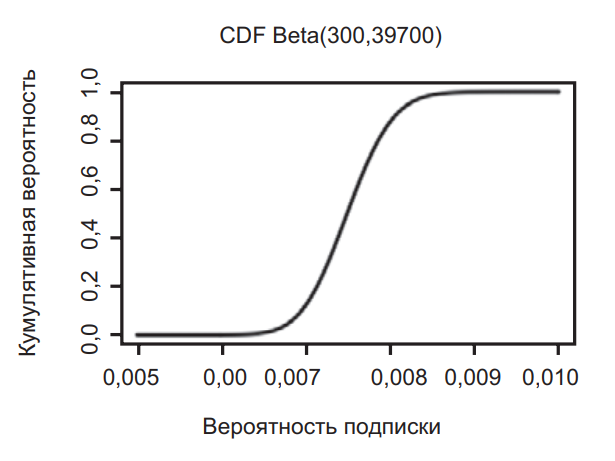
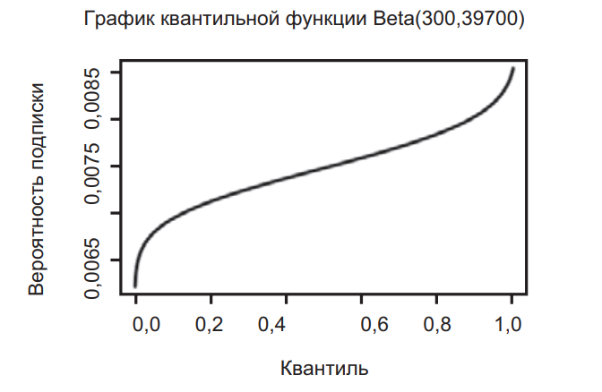

# Занятие 07. 14.03.2024 Инструменты оценки параметров: PDF, CDF и квантильная функция. Оценка параметров с априорными вероятностями

## Концепт-карты

### Концепт-карта Глава 13


### Концепт-карта Глава 14


## Задача 1

### Условие задачи

Используя пример кода для построения PDF на с. 155, постройте функции CDF и
квантильную.

### Решение задачи

Взяв код из главы, заменяем dbeta() на pbeta() для CDF следующим образом:

```r
xs <- seq(0.005,0.01,by=0.00001)
plot(xs,pbeta(xs,300,40000-300),type='l',lwd=3,
    ylab="Cumulative probability",
    xlab="Probability of subscription",
    main="CDF Beta(300,39700)")
```

Для квантильной функции нужно заменить xs на фактические квантили:

```r
xs <- seq(0.001,0.99,by=0.001)
plot(xs,qbeta(xs,300,40000-300),type='l',lwd=3,
    ylab="Probability of subscription",
    xlab="Quantile",
    main="Quantile of Beta(300,39700)")
```

### Ответ





### Проверка

Нету

## Задача 2

### Условие задачи

Возвращаясь к задаче измерения снежного покрова из главы $10$, скажем,
что у вас есть следующие измерения (в дюймах) снежного покрова:

$$
7,8, 9,4, 10,0, 7,9, 9,4, 7,0, 7,0, 7,1, 8,9, 7,4.
$$

Каков $99,9$%-ный доверительный интервал для истинного значения
снежного покрова?

### Решение задачи

Сначала вычислим среднее значение и стандартное отклонение для
этих данных:

```r
snow.data <- c(7.8, 9.4, 10.0, 7.9, 9.4, 7.0, 7.0, 7.1, 8.9, 7.4)
snow.mean <- mean(snow.data)
snow.sd <- sd(snow.data)
```

Затем используем qnorm() для вычисления верхней и нижней границ доверительного интервала 99,9 %.

- Нижний — qnorm(0,0005,mean=snow.mean,sd=snow.sd) = 4,46.
- Верхний — qnorm(0,9995,mean=snow.mean,sd = snow.sd) = 11,92.

Это означает, что мы очень уверены в том, что выпадает не менее 4,46 дюйма
снега и не более 11,92 дюйма.

### Ответ

- Нижний — qnorm(0,0005,mean=snow.mean,sd=snow.sd) = 4,46.
- Верхний — qnorm(0,9995,mean=snow.mean,sd = snow.sd) = 11,92.

Это означает, что мы очень уверены в том, что выпадает не менее 4,46 дюйма
снега и не более 11,92 дюйма.

### Проверка

Нету

## Задача 3

### Условие задачи

Девочка продает конфеты. Пока она посетила $30$ домов и продала $10$ конфет.
Сегодня она посетит еще $40$ домов. Каков $95$%-ный доверительный
интервал для того, сколько конфет она продаст за остаток дня?

### Решение задачи

Сначала нужно рассчитать 95 % доверительный интервал для вероятности продажи
конфеты. Мы можем смоделировать это как Beta(10,20),
а затем использовать qbeta(), чтобы вычислить значения:

- Нижнее значение — qbeta(0,025,10,20) = 0,18.
- Верхнее значение — qbeta(0,975,10,20) = 0,51.

Учитывая, что осталось посетить 40 домов, мы можем ожидать, что она продаст
от 40 × 0,18 = 7,2 до 40 × 0,51 = 20,4 конфеты. Конечно, девочка может
продать только целые конфеты, поэтому мы уверены, что она продаст от
7 до 20 конфет.

Если нужна конкретика, мы могли бы фактически вычислить квантильную
функцию для биномиального распределения на каждом экстремуме ее
уровня продаж с помощью qbinom()! Я оставлю это в качестве упражнения,
которое вы можете изучить самостоятельно.

### Ответ

Учитывая, что осталось посетить 40 домов, мы можем ожидать, что она продаст
от 40 × 0,18 = 7,2 до 40 × 0,51 = 20,4 конфеты. Конечно, девочка может
продать только целые конфеты, поэтому мы уверены, что она продаст от
7 до 20 конфет.

Если нужна конкретика, мы могли бы фактически вычислить квантильную
функцию для биномиального распределения на каждом экстремуме ее
уровня продаж с помощью qbinom()! Я оставлю это в качестве упражнения,
которое вы можете изучить самостоятельно.

### Проверка

Нету

## Задача 4

### Условие задачи

Предположим, вы играете в аэрохоккей с друзьями и подбрасываете
монетку, чтобы узнать, кто будет подавать шайбу. Проиграв $12$ раз, вы
понимаете, что друг, который приносит монету, почти всегда идет первым:

$9$ из $12$ раз. Некоторые из ваших друзей начинают что-то подозревать.
Определите априорное распределение вероятностей для следующих
убеждений:

- убеждения человека, который слабо верит, что друг обманывает
    и реальная скорость выпадения орла ближе к $70$%;
- убеждения человека, который очень сильно верит, что монетка
    честная и дает $50$%-ную вероятность выпадения орла;
- убеждения человека, который твердо верит, что монета
    склонна к выпадению орла в $70$% случаев.

### Решение задачи

Выбор этих априорных значений немного субъективен, но вот несколько примеров, которые соответствуют каждому убеждению:

- Beta(7,3) — достаточно слабое априорное значение, представляющее
    уверенность в том, что показатель приближается к 70 %.
- Beta(1000,1000) — очень сильное убеждение в том, что монетка честная.
- Beta(70,30) — это гораздо более сильное убеждение в том, что монетка
    смещена до 70 %-ной вероятности выпадения орла.

### Ответ

Выбор этих априорных значений немного субъективен, но вот несколько примеров, которые соответствуют каждому убеждению:

- Beta(7,3) — достаточно слабое априорное значение, представляющее
    уверенность в том, что показатель приближается к 70 %.
- Beta(1000,1000) — очень сильное убеждение в том, что монетка честная.
- Beta(70,30) — это гораздо более сильное убеждение в том, что монетка
    смещена до 70 %-ной вероятности выпадения орла.

### Проверка

нету

## Задача 5

### Условие задачи

Чтобы проверить монету, вы подбрасываете ее еще $20$ раз и получаете
$9$ орлов и $11$ решек. Используя априорные вероятности, которые вы
рассчитали в предыдущем вопросе, определите обновленные апостериорные
убеждения в истинной вероятности выпадения орла с точки
зрения $95$%-ного доверительного интервала.

### Решение задачи

Теперь у нас есть обновленный набор данных с 32 наблюдениями, которые
включают 18 орлов и 14 решек. Используя qbeta() в R и априорные
вероятности из предыдущих задач, мы можем получить 95 %-ный доверительный
интервал для этих различных убеждений.

Просто рассмотрим код для Beta(7,3), поскольку другие примеры идентичны этому.

- Нижняя граница для 95 %-ного интервала — qbeta (0,025,18 + 7,14 + 3) = 0,
    445, а верхняя граница — qbeta (0,975,18 + 7,14 + 3) = 0,737.
- Для Beta(1000,1000) имеем: 0,479 – 0,523.
- И для Beta(70,30) имеем: 0,5843 – 0,744.

Итак, как вы можете видеть, слабая априорная вероятность обеспечивает
самый широкий диапазон возможностей, очень сильная априорная вероятность
честности монетки остается вполне правдоподобной, а сильная
априорная вероятность в 70 % по-прежнему склоняется к более высокому
диапазону возможных значений истинной честности монетки.

### Ответ

Итак, как вы можете видеть, слабая априорная вероятность обеспечивает
самый широкий диапазон возможностей, очень сильная априорная вероятность
честности монетки остается вполне правдоподобной, а сильная
априорная вероятность в 70 % по-прежнему склоняется к более высокому
диапазону возможных значений истинной честности монетки.

### Проверка

Нету
