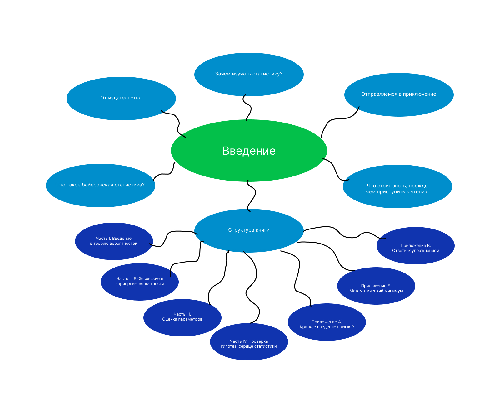

# Занятие 01. 18.01.2024 Тема: Байесовская статистика и основы теории вероятностей

# Концепт-карты

## Концепт-карта 1



## Концепт-карта 2


## Концепт-карта 3


# Глава 1

## Упражнение 1

### Условие задачи

Перепишите утверждения ниже, используя математическую нотацию из этой главы:
- вероятность дождя низкая;
- вероятность дождя при условии облачности высокая;
- вероятность, что вы с зонтом при условии дождя, выше, чем просто вероятность, что вы с зонтом.

### Решение задачи

Применим математическую нотацию

Вероятность дождя низкая: P(Дождь) = Низкая

Вероятность дождя при условии облачности высокая: P(Дождь | Облачно) = Высокая

Вероятность, что вы с зонтом придете домой: P(Зонт | Дождь) > P(Зонт)

### Ответ

P(Дождь) = Низкая

P(Дождь | Облачно) = Высокая

P(Зонт | Дождь) > P(Зонт)

### Проверка

Ответ соответствует стилю математической нотации:

P(дождь) = весьма высокая, где $P$ — обозначение для вероятности, а данные перечислены в скобках

- Дождь - событие дождя
- Облачность - событие облачности
- Зонт - событие наличия зонта

## Упражнение 2

### Условие задачи

Запишите, используя математические обозначения из этой главы, данные из такой истории. Придумайте гипотезу, объясняющую эти данные.

Вы приходите домой с работы и замечаете, что дверь открыта, а окно разбито. Войдя, вы видите, что вашего ноутбука нет на месте.

### Решение задачи

Сначала необходимо описать наши данные с помощью переменной:

$D$ = дверь открыта, окно разбито, ноутбук отсутствует

Непосредственным объяснением этих данных является то, что произошло
ограбление

$H1$ = Вы были ограблены

Вероятность увидеть все это при условии, что вас ограбили: $P(D | H1)$

### Ответ

P(D | H1)

### Проверка

$D$ - событие, описывающее все три факта, которые вы наблюдали при своем приходе домой.

$H1$ - Гипотеза. Она объясняет все наблюдаемые данные, так как они указывают на то, что кто-то разбил окно, вошел в квартиру и украл ноутбук.

Таким образом, можно записать это как "Вероятность наблюдения всех этих вещей, при условии, что вы были ограблены" и выразить это как: $P(D|H1)$

## Упражнение 3

### Условие задачи

К вам подбегает соседский ребенок и долго извиняется, что случайно попал камнем в ваше окно. Он говорит, что заметил ноутбук и испугался, что его украдут. Открыв дверь, он унес его к себе до вашего прихода.

### Решение задачи

Теперь у нас есть другая гипотеза о наблюдаемых данных:

H2 = ребенок случайно разбил окно и взял ноутбук на хранение.

Мы можем выразить это следующим образом:

$$
P(D | H2) >> P(D | H1)
$$

И ожидаем получить:

$$
\frac{P(D|H_2)}{P(D|H_1)} = \text{Большое число}
$$

Конечно, вы можете подумать, что ребенок тот еще шутник и все в округе знают его как хулигана. Это может изменить ваше мнение о том, насколько правдоподобно его объяснение, и привести к гипотезе о том, что он украл


### Ответ

H2 = ребенок случайно разбил окно и взял ноутбук на хранение.

### Проверка

Новые данные из истории можно записать следующим образом:

D = Дверь открыта, Окно разбито, Ноутбук пропал, Ребенок попал камнем в окно, Ребенок унес ноутбук, Ребенок извинился
Таким образом, D. описывает все факты, которые вы наблюдали после того, как подбежал соседский ребенок.


# Глава 2

## Упражнение 1

### Условие задачи

Какова вероятность бросить два шестигранных кубика и получить в сумме больше 7?

### Решение задачи

Существует 36 возможных способов бросить два кубика. Можно выписать все на бумаге. Пятнадцать пар из этих 36 больше 7. Таким образом, вероятность получения значения больше 7 составляет 15/36.

### Ответ

$$
P = \frac{P(\text{Нужные нам})}{P(\text{Все})} = 15/36 = 0.4167
$$

### Проверка

Всего исходов 36

Благоприятные исходы включают в себя пары $(4, 4), (5, 3), (5, 2), (5, 1), (6, 2), (6, 1), (6, 0), (4, 3), (4, 2), (4, 1), (3, 3), (3, 2), (3, 1), (2, 2), (2, 1), (1, 1)$. Всего таких пар $15$.

$$
P = \frac{P(\text{Нужные нам})}{P(\text{Все})} = 15/36 = 0.4167
$$

## Упражнение 2

### Условие задачи

Какова вероятность бросить три шестигранных кубика и получить в сумме больше 7?

### Решение задачи

При трех бросках существует 216 различных возможных результатов.

Мы можем записать их на листе бумаги, и это допустимо, но займет довольно много времени. Мы найдём ответ с помощью простого набора циклов `for` на нескольких языках:

`R`:

```r
fn main() {
    let mut count = 0;
    for roll1 in 1..=6 {
        for roll2 in 1..=6 {
            for roll3 in 1..=6 {
                count += if roll1 + roll2 + roll3 > 7 { 1 } else { 0 };
            }
        }
    }
    println!("Count: {}", count);
}
```

`JavaScript`:

```js
let count = 0;
for (let roll1 = 1; roll1 <= 6; roll1++) {
  for (let roll2 = 1; roll2 <= 6; roll2++) {
    for (let roll3 = 1; roll3 <= 6; roll3++) {
      count += roll1 + roll2 + roll3 > 7 ? 1 : 0;
    }
  }
}
```

`Rust`:

```rust
fn main() {
    let mut count = 0;
    for roll1 in 1..=6 {
        for roll2 in 1..=6 {
            for roll3 in 1..=6 {
                count += if roll1 + roll2 + roll3 > 7 { 1 } else { 0 };
            }
        }
    }
    println!("Count: {}", count);
}
```

Счетчик равен $181$, поэтому вероятность того, что выпадет больше $7$, равна $\frac{181}{216}$.

### Ответ

$$
P = \frac{P(\text{Нужные нам})}{P(\text{Все})} = \frac{181}{216}
$$

### Проверка

Код рабочий. Всё отлично.

## Упражнение 3

### Условие задачи

Играют команды «Янки» и «Ред Сокс». Вы — преданный фанат «соксов» и заключаете с другом пари на их выигрыш. Если «Сокс» проиграет, вы платите другу $30$ долларов, если выиграет — друг платит вам $5$ долларов.

Какую вероятность вы присвоите гипотезе, что выиграет «Ред Сокс»?

### Решение задачи

Мы видим, что предполагаемые шансы победы «Ред Сокс» составляют:

$$
O(\text{«РедСокс» выиграет})=\frac{30}{5}=6
$$

Вспоминая нашу формулу для преобразования шансов в вероятности, мы можем преобразовать шансы в вероятность того, что выиграет «Ред Сокс»:

$$
Р(\text{«РедСокс» выиграет}) = \frac{\text{О(«Ред Сокс» выиграет)}}{\text{1+О(«РедСокс» выиграет)}} = \frac{6}{7}
$$

Итак, основываясь на сделанной ставке, вы можете сказать, что вероятность того, что «Ред Сокс» выиграет, составляет около $86%$.

### Ответ

$$
P = \frac{P(\text{Нужные нам})}{P(\text{Все})} = \frac{6}{7} = 0.86
$$

### Проверка

Всё верно. Всё отлично.