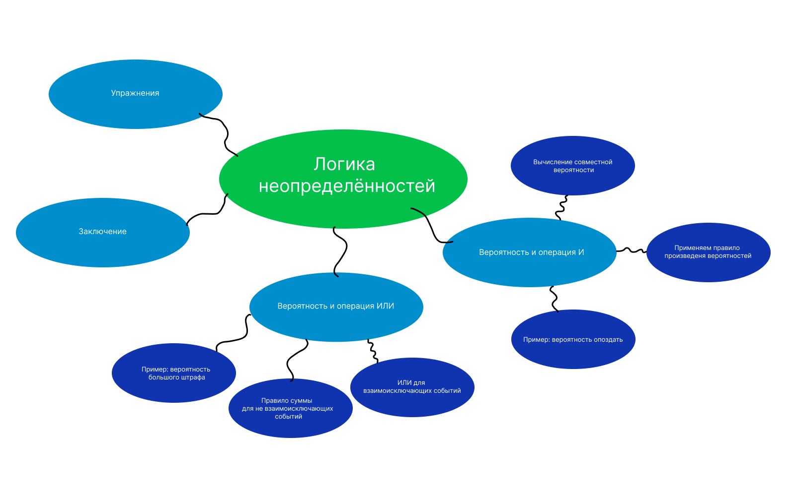
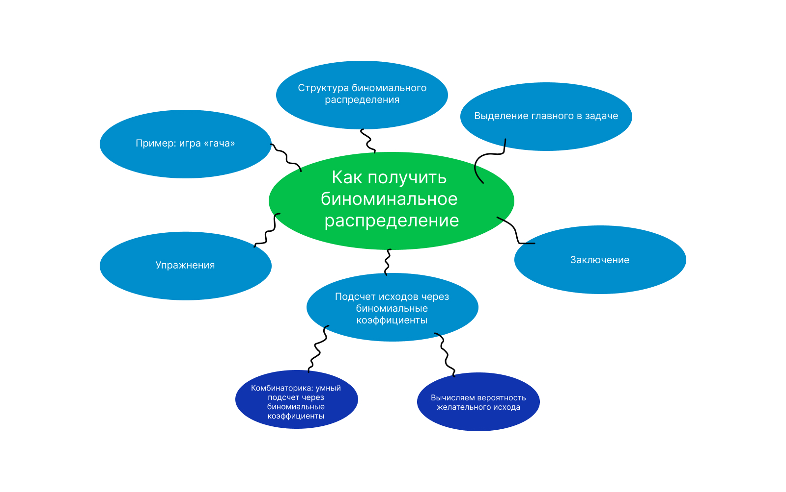

# Занятие 02. 25.01.2024 Логика неопределённости. Получение дискретного

## Концепт-карты

### Концепт-карта Глава 3



### Концепт-карта Глава 4



## Глава 3

### Упражнение 1

#### Условие задачи

Какова вероятность выбросить двадцать на двадцатигранной игральной
кости три раза подряд?

#### Решение задачи

Вероятность выпадения 20 составляет 1/20, и чтобы определить
вероятность выпадения трех 20 подряд, мы должны использовать правило
произведения вероятностей:

$$
P = p_1 * p_2 * p_3
$$

$$
p_1 = \frac{1}{20}
$$

$$
p_2 = \frac{1}{20}
$$

$$
p_3 = \frac{1}{20}
$$

$$
P = p_1 * p_2 * p_3 = (\frac{1}{20})^3 = \frac{1}{8000} = 0.000125
$$

#### Ответ

$$
P = \frac{1}{20}^3 = \frac{1}{8000} = 0.000125
$$

#### Проверка

```python
import random

N = 10 ** 6
n = 0

def dice_roll():
    return random.randint(1, 20)

def check_sequence():
    sequence = []
    for _ in range(3):
        roll = dice_roll()
        sequence.append(roll)
        if roll != 20:
            return False
    return True

for _ in range(N):
    if check_sequence():
        n += 1

print("Проверено последовательностей: ", N)
print("Успешных последовательностей: ", n)
print("Вероятность выпадения числа 20 три раза подряд: ", n / N)
```

### Упражнение 2

#### Условие задачи

Прогноз погоды сообщает, что завтра с 10 %-ной вероятностью пойдет
дождь. Вы забываете зонтик дома в половине случаев. Какова вероятность,
что завтра вы окажетесь под дождем без зонта?

#### Решение задачи

Использользуем правило произведения вероятностей

Вероятность дождья составляет:
$$
P_1 = 0.1
$$

Вероятность пойти без зонта составляет:
$$
P_2 = 0.5
$$

Вероятность, что пойдёт дождь и пойти без зонта составляет:
$$
P(P_1, P_2) = P_1 * P_2 = 0.5 * 0.1 = 0.05
$$

#### Ответ

$$
P(P_1, P_2) = 0.05
$$

#### Проверка

```python
import random

N = 10 ** 6
n = 0

for _ in range(N):
    rain = random.randint(0, 9)
    umbrella = random.randint(0, 1)
    if rain == 1 and umbrella == 1:
        n += 1

result = n / N

print("Проверено последовательностей: ", N)
print("Успешных последовательностей: ", n)
print("Приближенная вероятность:", result)
```

### Упражнение 3

#### Условие задачи

Сырые яйца с вероятностью 1/20 000 заражены сальмонеллой. Вы съели
два сырых яйца, какова вероятность, что вы съели яйцо с сальмонеллой?

#### Решение задачи

Для решения этой задачи нужно использовать правило суммы
вероятностей, потому что если какое-либо яйцо содержит
сальмонеллу, вы заболеете:

Яйцо 1:
$$
P_1 = \frac{1}{20000}
$$

Яйцо 2:
$$
P_2 = \frac{1}{20000}
$$

Итого:
$$
P(P_1, P_2) = P_1 + P_2 - P_1 \cdot P_2 = 
$$
$$
\frac{1}{20000} + \frac{1}{20000} - \frac{1}{400000000} = \frac{39999}{400000000}
$$


#### Ответ

$$
P(P_1, P_2) = P_1 + P_2 - P_1 \cdot P_2 = \frac{39999}{400000000}
$$

#### Проверка

Python:

```python
import random

N = 10 ** 6
n = 0

for _ in range(N):
    egg1 = random.randint(0, 19999)
    egg2 = random.randint(0, 19999)
    if egg1 == 1 or egg2 == 1:
        n += 1

result = n / N

print("Проверено последовательностей: ", N)
print("Успешных последовательностей: ", n)
print("Приближенная вероятность:", '{:.90f}'.format(result))

p1 = 1 / 20000
p2 = 1 / 20000
result2 = p1 + p2 - p1 * p2
r = '{:.90f}'.format(result2)
print("Вероятность по формуле:", r)

result3 = result - result2

print("")
print("Расхождение:", '{:.90f}'.format(result3))
```

Rust:

```rust
use rand::Rng;
use std::fmt;
use std::string::ToString;

fn main() {
    let mut rng = rand::thread_rng();
    let mut n = 0;
    let N = 10usize.pow(8);

    for _ in 0..N {
        let egg1 = rng.gen_range(0..=19999);
        let egg2 = rng.gen_range(0..=19999);
        if egg1 == 1 || egg2 == 1 {
            n += 1;
        }
    }

    let result = n as f64 / N as f64;
    let result_str = format!("{:.90}", result);
    println!("Проверено последовательностей: {}", N);
    println!("Успешных последовательностей: {}", n);
    println!("Приближенная вероятность: {}", result_str);

    let p1 = 1.0 / 20000.0;
    let p2 = 1.0 / 20000.0;
    let result2 = p1 + p2 - p1 * p2;
    let r = format!("{:.90}", result2);
    println!("Вероятность по формуле: {}", r);

    let result3 = result - result2;
    println!("");
    println!("Расхождение: {:.90}", result3);
}
```


### Упражнение 4

#### Условие задачи

Какова вероятность выкинуть два орла за два броска монеты или три
шестерки за три броска шестигранного кубика?

#### Решение задачи

Вероятность выпадения 2 орлов за 2 броска:
$$
P_1 = \frac{1}{2} \cdot \frac{1}{2} = \frac{1}{4}
$$

Вероятность выпадения 3 шестёрок за 3 броска:
$$
P_2 = \frac{1}{6} \cdot \frac{1}{6} \cdot \frac{1}{6} = \frac{1}{216}
$$

Вероятность $P_1$ или $P_2$:
$$
P(P_1, P_2) = P_1 + P_2 - P_1 \cdot P_2 = \frac{219}{864} = \frac{73}{288}
$$

#### Ответ

$$
P(P_1, P_2) = P_1 + P_2 - P_1 \cdot P_2 = \frac{73}{288}
$$

#### Проверка

Python:

```python
import random

p1 = (1 / 2) ** 2
p2 = (1 / 6) ** 3
formula_result = p1 + p2 - p1 * p2

N = 10 ** 6
n = 0

for _ in range(N):
    l1 = []
    l2 = []
    for _ in range(2):
        l1.append(random.randint(0, 1))
    for _ in range(3):
        l2.append(random.randint(1, 6))
    
    l1 = list(filter(lambda i: i == 0, l1))
    l2 = list(filter(lambda i: i == 6, l2))

    if len(l1) == 2 or len(l2) == 3:
        n = n + 1

result = n / N

print("Проверено последовательностей: ", N)
print("Успешных последовательностей: ", n)
print("")
print("Приближенная вероятность:", '{:.90f}'.format(result))
print("Вероятность по формуле:", '{:.90f}'.format(formula_result))
print("")
print("Абсолютное расхождение:", '{:.90f}'.format(abs(result - formula_result)))
print("Отноосительное расхождение:", '{:.90f}'.format(abs(result - formula_result) / formula_result * 100))
```

Rust:

```rust
use rand::Rng;

fn main() {
    let p1 = (1.0f64 / 2.0f64).powi(2);
    let p2 = (1.0f64 / 6.0f64).powi(3);
    let formula_result = p1 + p2 - p1 * p2;

    let mut rng = rand::thread_rng();
    let N = 10u64.pow(8);
    let mut n = 0;

    for _ in 0..N {
        let mut l1 = Vec::new();
        let mut l2 = Vec::new();
        for _ in 0..2 {
            l1.push(rng.gen_range(0..=1));
        }
        for _ in 0..3 {
            l2.push(rng.gen_range(1..=6));
        }

        l1 = l1.into_iter().filter(|&i| i == 0).collect();
        l2 = l2.into_iter().filter(|&i| i == 6).collect();

        if l1.len() == 2 || l2.len() == 3 {
            n += 1;
        }
    }

    let result = n as f64 / N as f64;

    println!("Проверено последовательностей: {}", N);
    println!("Успешных последовательностей: {}", n);
    println!("");
    println!("Приближенная вероятность: {:.90}", result);
    println!("Вероятность по формуле: {:.90}", formula_result);
    println!("");
    println!("Абсолютное расхождение: {:.90}", result - formula_result);
    println!("Отноосительное расхождение: {:.90}", (result - formula_result) / formula_result * 100.0);
}

```

## Глава 4

### Упражнение 1

#### Условие задачи

Каковы параметры биномиального распределения для вероятности
выкинуть один или двадцать на двадцатигранной кости, если бросить
кость 12 раз?

#### Решение задачи

Мы рассматриваем событие, происходящее 1 раз из 12 попыток, поэтому
n = 12 и i = 1. Мы имеем 20 сторон, и важны две из них, поэтому
p = 2/20 = 1/10.

$$
n = 12
$$

$$
i = 1
$$

$$
p = \frac{1}{10}
$$


#### Ответ

$$
n = 12
$$

$$
i = 1
$$

$$
p = \frac{1}{10}
$$

#### Проверка

Она есть

### Упражнение 2

#### Условие задачи

В колоде из 52 карт четыре туза. Вы вытягиваете карту, возвращаете ее
обратно, тасуете колоду и снова вытягиваете карту. Сколькими способами
можно вытянуть только одного туза за пять попыток?

#### Решение задачи

Колода состоит из 52 карт, четыре из которых - тузы. Поскольку после каждой попытки вы возвращаете тузу обратно в колоду, число тузов в колоде остается неизменным. Это означает, что мы можем рассматривать каждую попытку как отдельный эксперимент, независимый от других.

Для того чтобы вытащить только один туз, нужно вытащить не туз на первых четырех попытках и туз на последней. Количество способов вытащить не туз в одной попытке - это 48 (количество карт, которые не являются тузом). Таким образом, количество способов вытащить не туз на первой попытке - это 48. Аналогично, на второй, третьей и четвертой попытках количество способов также равно 48.

Количество способов вытащить туз на последней попытке - это 4 (количество тузов в колоде).

Таким образом, общее количество способов вытащить только один туз в пяти попытках равно произведению количества способов каждого из этих событий, то есть 48 * 48 * 48 * 48 * 4 = 48^4 * 4.

Ещё нужно перебрать когда мы вытаскиваем туз (первым, вторым, третьим, четвертым или пятым), поэтому домножаем на 5

Итого:
$$
48^4 * 4 * 5 = 106168320
$$

#### Ответ

$$
C_5^1 * 48^4 * 4 = 48^4 * 4 * 5 = 106168320
$$

#### Проверка

```python
print((48 ** 4) * 4 * 5)
```

### Упражнение 3

#### Условие задачи

Продолжая предыдущую задачу: какова вероятность вытянуть пять
тузов за десять попыток (помните, что карта возвращается в колоду!)?

#### Решение задачи

В этот раз:
$$
C_10^5 * 48^5 + 4^5 = 254805244
$$


#### Ответ

$$
C_10^5 * 48^5 + 4^5 = 254805244
$$

#### Проверка

```python
import math

def func_c(n, i):
    return math.factorial(n) / (math.factorial(n - i) * math.factorial(i))

print( 48**5 + 4**5 + func_c(10, 5))
```


### Упражнение 4

#### Условие задачи

При поиске новой работы полезно иметь больше одного предложения —
это открывает возможность поторговаться. Пусть вероятность получить
после собеседования предложение о работе равна 1/5, и за месяц вы проходите семь собеседований. Какова вероятность, что к концу месяца вы
получите хотя бы два предложения?

#### Решение задачи

$$
p = \frac{1}{5}
$$

$$
N = 7
$$

$$
\Sigma_{i=2}^7 C_7^i \cdot p^i \cdot (1 - p)^{7 - i}
$$

```python
from scipy.stats import binom

N = 7
p = 1/5

print(1 - binom.cdf(1, N, p))
```

#### Ответ

$$
P = 0.4232832000000004
$$

#### Проверка

```python
from scipy.stats import binom

N = 7
p = 1/5

print(1 - binom.cdf(1, N, p))
```

### Упражнение 5

#### Условие задачи

Вы получили немало писем от рекрутеров и обнаружили, что в следующем месяце у вас 25 собеседований. Ох, это утомительно, а вероятность
получить предложение о работе, когда проходишь собеседование усталым, падает до 1/10. Вы готовы пройти 25 собеседований, только если
это в два раза повысит вероятность получить хотя бы два предложения.
Надо ли проходить 25 собеседований или остановиться на семи?

#### Решение задачи

```python
from scipy.stats import binom

p_two_or_less_7 = binom.cdf(1, 7, 1/5, loc=0)
p_two_or_less_25 = binom.cdf(1, 25, 1/10, loc=0)

p_two_or_more_7 = 1 - p_two_or_less_7
p_two_or_more_25 = 1 - p_two_or_less_25

result = p_two_or_more_25 / p_two_or_more_7
print(result)
```

#### Ответ

$$
1.7217647512082515
$$

#### Проверка

```python
from scipy.stats import binom

p_two_or_less_7 = binom.cdf(1, 7, 1/5, loc=0)
p_two_or_less_25 = binom.cdf(1, 25, 1/10, loc=0)

p_two_or_more_7 = 1 - p_two_or_less_7
p_two_or_more_25 = 1 - p_two_or_less_25

result = p_two_or_more_25 / p_two_or_more_7
print(result)
```
