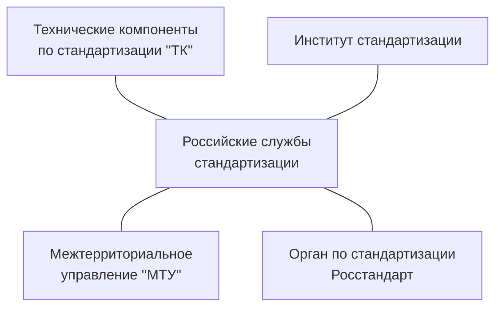
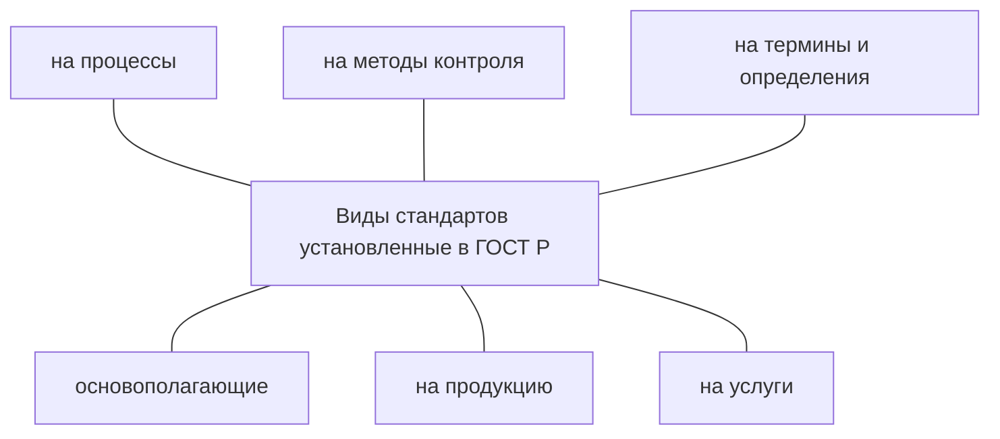

#2023.09.05

# Основы стандартизации

Стандарт - это нормативно технический документ по стандартизации, установляющих комплекс норм, правил, требований к объекту стандартизации и утверждённый компитентными органами.

Объект стандартизации: сырьё, продукция (материал), работы, услуги

Стандартизация - это деятельность по установлению норм правил, характеристик, как обязательных к выполнению, так и рекомендованных.

Цель стандартизации: достижение максимальной степени упорядовачивания в той или иной области, по средствам широкого и многократного использования установленных положений, требований, норм для решения реално существующих, планируемых или потенциальных задач.

Задачи стандартизации:

- Безопастность продукции, работ, услуг для жизни и здоровья людей, окружающей среды и имущества
- Совместимость и взаимозаменяемость изделий
- Качество продукции, работ и услуг в соответствии с уровнем развития научно-технического прогресса
- Единство измерений
- Достижение оптимальной степени упорядоченности в той или иной области
- Экономию всех видов ресурсов
- Безопастность хозяйственных объектов, связанную с возможностью возникновения различных катастроф (природного и техногенного характера) и ЧС
- Обороноспособность и мобилизационную готовность страны

Основные результаты стандартизации:

- повышение степени соответствия продукта (услуги), процессов их функциональному назначению
- Устранение технических барьеров в международном товарообмене
- Содействие научно-техническому прогруссу и сотруднечеству в различных областях

#2023.09.05

# Методы стандартизации

Стандартизация как вид деятельности предусматривает комплекс методов, необходимых для оптимального решения повторяющихся задач и установления его в качестве норм и правил.

Базовые методы:

1. Упорядочивание объектов стандартизации
2. Параметрическая стандартизация
3. Унификация продукции
4. Агрегативирование
5. Комплексная стандартизация
6. Опережающая стандартизация

## Упорядочивание объектов стандартизации

**Упорядочивание объектов стандартизации** - универсальный метод в области стандартизации продукции, процессов и услуг, направленный на сокращение многообразия.

Упорядочивание состоит из отдельных методов: **систематизации, селекции, симплификации, типизации и оптимизации.**

- Языки программирования
    - По уровню абстракции
        - Низкоуровневые (Ассемблер)
        - Высокоуровневые (C, C++, Java, Haskell)
    - По парадигме программирования
        - Императивные (C, C++, Java)
        - Декларативные (SQL)
        - Функциональные (Haskell)
    - По типизации
        - Статически/динамически типизирование
        - Сильно/слабо типизированные

### Систематизация объектов

**Систематизация объектов** стандартизации заключается в научно обоснованном последовательном классифицировании и ранжировании совокупности конкретных объектов стандартизации.

Пример: Общероссийский классификатор промышленной и сельскохозяйственной продукции (ОКП), который систематизирует всю товарную продукцию в виде различных классификационных группировок и конкретных наименований продукции.

### Селекция объектов

**Селекция объектов** стандартизации – деятельность, заключающаяся в отборе таких конкретных объектов, которые признаются целесообразными для дальнейшего производства и применения в общественном производстве.

### Симплификация

**Симплификация (метод ограничений)** – деятельность, заключающаяся в определении таких конкретных объектов, которые нецелесообразными для дальнейшего производства

### Типизация объектов

**Типизация объектов стандартизации** - деятельность по созданию типовых (образцовых) объектов – конструкций, технологических правил, форм документации.

В отличие от селекции отобранные конкретные объекты
помогают каким-либо техническим преобразованиям, направленным на повышение их качества и универсальности.

### Оптимизация объектов стандартизации

**Оптимизация объектов стандартизации** – заключается в нахождении оптимальных главных параметров, а также всех других показателей качества и экономичности.

## Параметрическая стандартизация

**Параметрическая стандартизация** – заключается в выборе и обосновании целесообразной номенклатуры и численного значения параметров.

## Унификация

**Унификация** представляет собой рациональное сокращение числа типов деталей, агрегатов одинакового функционального назначения. Она базируется на классификации и ранжировании, селекции и симплификации, типизации и оптимизации элементов готовой продукции.

## Агрегатирование

**Агрегатирование** – это метод создания машин, приборов и оборудования из отдельных стандартных унифицированных узлов, многократно используемых при создании различных изделий на основе геометрической и функциональной взаимозаменяемости.

Пример: модульный принцип широко распространен в радиоэлектронике и приборостроении.

## Комплексная стандартизация

**Комплексная стандартизация** – при комплексной стандартизации (КС) осуществляются целенаправленное и планомерное установление и применение системы взаимоувязанных требований как к самому объекту комплексной стандартизации в целом, так и к его основным элементам в целях оптимального решения конкретной проблемы. 

## Опережающая стандартизация

**Опережающая стандартизация** – заключается в установлении повышенных по отношению к уже достигнутому на практике уровню норм и требований к объектам стандартизации, которые согласно прогнозам будут оптимальными в последующее время.

Пример:в конце 80-х годов было утверждение международного стандарта на аудиокомпактный диск до начала производства самого изделия. Это позволило обеспечить полную совместимость компакт-диска с другими техническими средствами и тем самым избежать непроизводительных затрат.

#2023.09.19

#2023.09.26

# Нормативные документы

Стандарт (лекция 1)

Национальный стандарт - стандарт, утверждённый национальными орнанами РФ по стандартизации.

Регламент - документ, содержащий обязательные правовые нормы и принятый органами власти.

Нормативный документ - документ, устанавливающий правила, общие принципы или характеристиками, касающиеся различных видов деятельности или их результатов.

Классификатор - нормативный документ, предоставляющий систематизированный вид наименований и кодов классифицируемых группировок и (или) объектов классификации.

Правила нормы по стандартизации - нормативный документ, устанавливающий обязательные для применения организационно-методологические положения, которые дополняют или контролируют отдельные положения положеня основополагающих национальных стандартов и определяет порядок и методы выполнения работ по стандартизации.

Рекомендации по стандартизации - документ, содержащий советы организациям.

# Системы стандартизации в РФ

Существует дву системы

1. Национальная система
    - Национальные стандарты
    - Правила стандартизации, рекомендации в области стандартизации
    - Общероссийский классификатор технико-экономической и социальной информации
2. Лакальная система
    - Действует в рамках организации.
    - Базируется на стандартах организаций, которые заменили стандарты предприятий (СТП), научно-технических, инженерных обществ и других общественных объединений (СТО). 

#2023.10.03

# Техническое регулирование

ФЗ от 27.12.2002 г. №184-Ф3 «О техническом регулировании»

Регулирование - это действие государства организующее действие субъектов на рынке.

Объекты технического регулирования: продукция, процессы жизненного цикла продукции, работы и услуги.

1. Проектирование качества
    1. Маркетинговое исследование
    2. Составление технического задания
    3. Проектирование и разработка рпроцесса (технологическая подготовка производства)
    4. Закупки
2. Обеспечение качества
    1. Изготовление
    2. Проверка
    3. Упаковывание
    4. Хранение
3. Поддержка и реализация качества
    1. Распределение и реализация (поставка)
    2. Эксплуатация (потребление, использование)
    3. Техническое обслуживание
    4. Утилизация

Техническое регулирование – правовое регулирование отношений в области установления, применения и использования обязательных требований к продукции или связанным с ними процессами проектирования выполнению работ или оказанию услуг и правовое регулирование отношений в области оценки соответствия.

Технический регламент – документ, принятый органом власти и содержащий технические требования, обязательные для исполнения и применения либо непосредственно, либо путем ссылок на стандарты.

