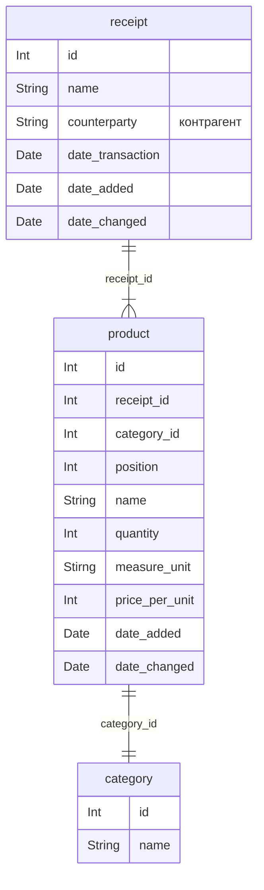

# home-accounting

```mermaid
erDiagram

    receipt {
        Int id

        String name
        String counterparty "контрагент" 
        Date date_transaction

        Date date_added
        Date date_changed
    }

    product {
        Int id
        Int receipt_id
        Int category_id
        
        Int position
        String name
        Int quantity
        Stirng measure_unit
        Int price_per_unit
        
        Date date_added
        Date date_changed
    }

    category {
        Int id
        String name
    }

    product ||--|| category : category_id
    receipt ||--|{ product : receipt_id
```
